Kubernetes为什么是水平触发而不是边缘触发？
====================================

> 导读：前段时间看到Tim Hockin在Twitter上发表一篇文章《Kubernetes: Edge vs. Level Triggered Logic》，看完之后发现这篇文章对理解Kubernetes的核心控制逻辑很有必要，于是就分享给大家，希望有兴趣的朋友在留言中讨论。

关于Kubernetes为什么使用水平触发，原因如下：

* 对于Kubernetes，状态比事件重要

* 水平触发正好符合可以多次状态检查的特性

* Client可以在任何时候检查/重复检查状态

* 这也是Kubernetes的核心控制逻辑

#### 背景知识
-------------

熟悉Linux网络编程的朋友都知道epoll的两个事件机制：水平触发(LT)和边缘触发(ET)。 在展示Tim Hockin的演讲稿之前，我们先做些理论准备：什么是水平触发和边缘触发。

##### 水平触发
------------

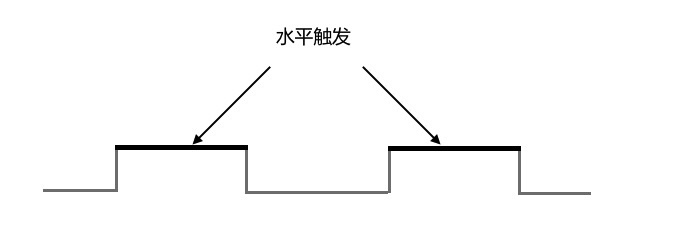

> Level Trigger:
> 1) The input signal is sampled when the clock signal is either HIGH or LOW. 
> 2) It is sensitive to Glitches. 
> Example: Latch

水平触发(Level Triggered)：只要满足一定条件（或者说中断发生），会触发一个事件，只要事件未发生变化，系统就会一直提醒应用程序，直到事件处理完成为止。

##### 边缘触发
------------

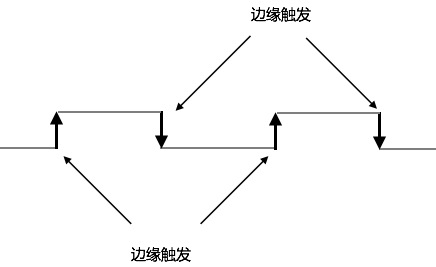

> 1) The input signal is sampled at the RISING EDGE or FALLING EDGE of the clock signal. 
> 2) It is not-sensitive to Glitches. 
> Example: Flipflop. 

边缘触发(Edge Triggered)，当状态变化的时候，会触发一个事件，以后如果状态一直没有变化或没有重新要求系统给出通知，将不再通知应用程序。

#### Kubernetes: Edge vs. Level Triggered
-------------------------------

下面是Tim Hockin的演讲胶片：

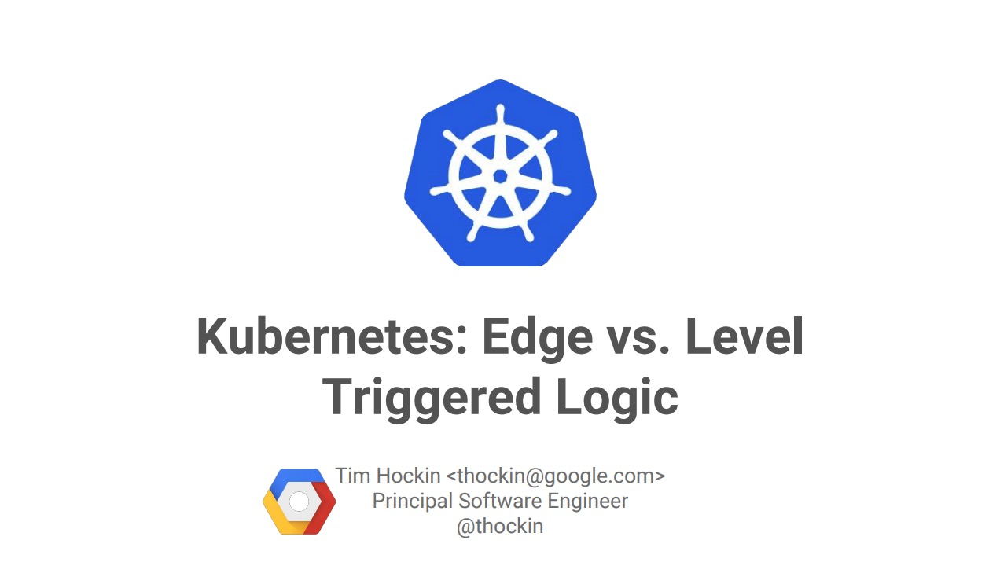

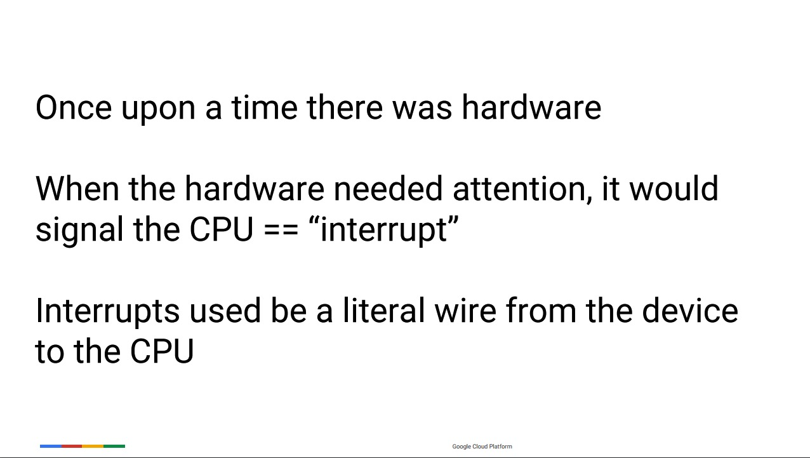

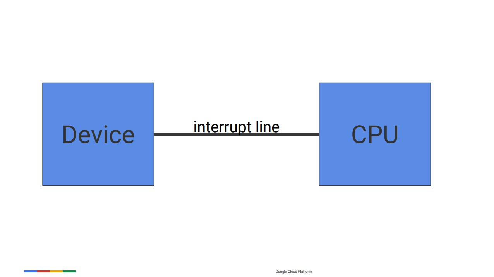

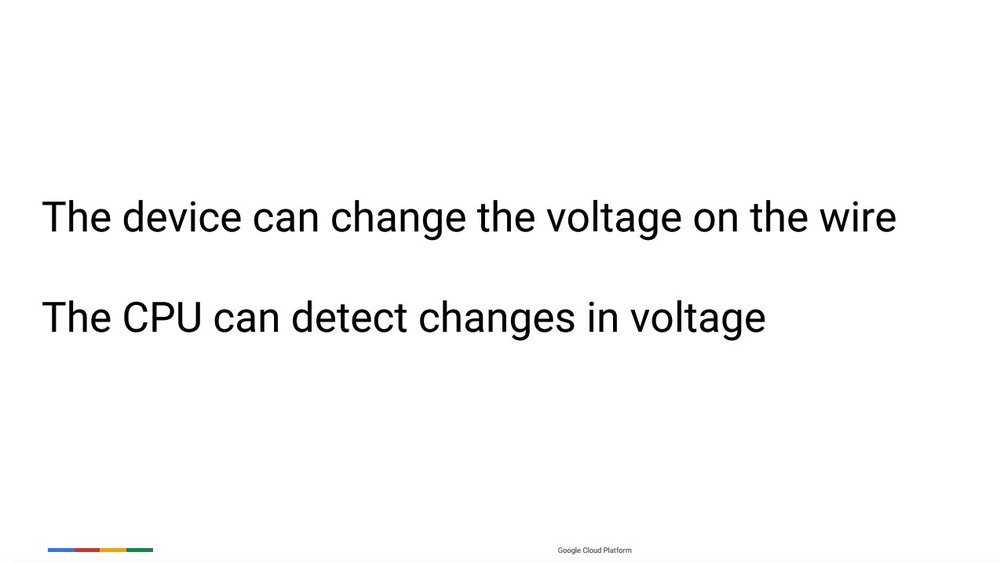

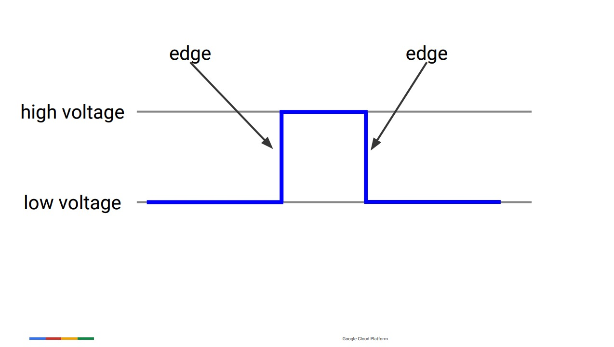

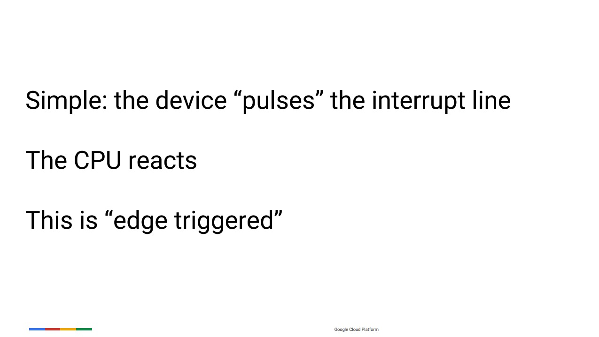

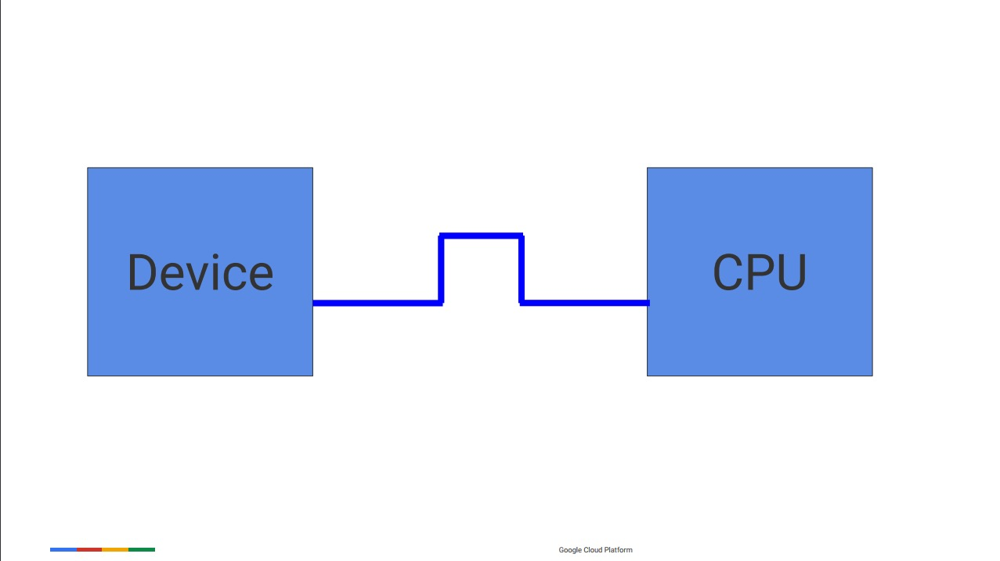

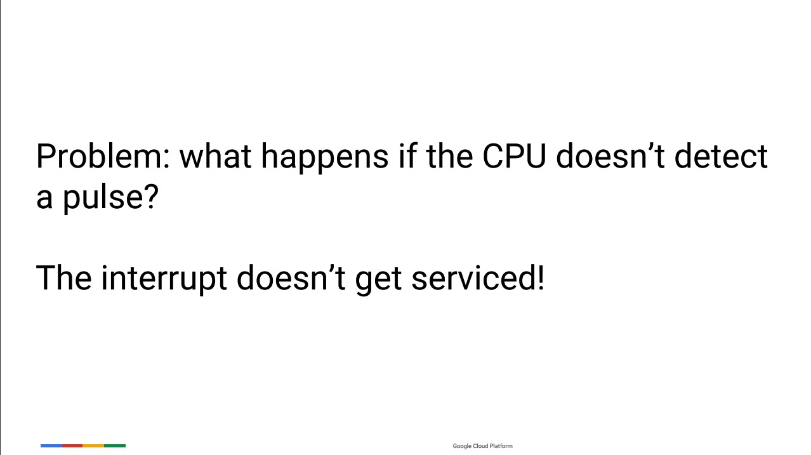

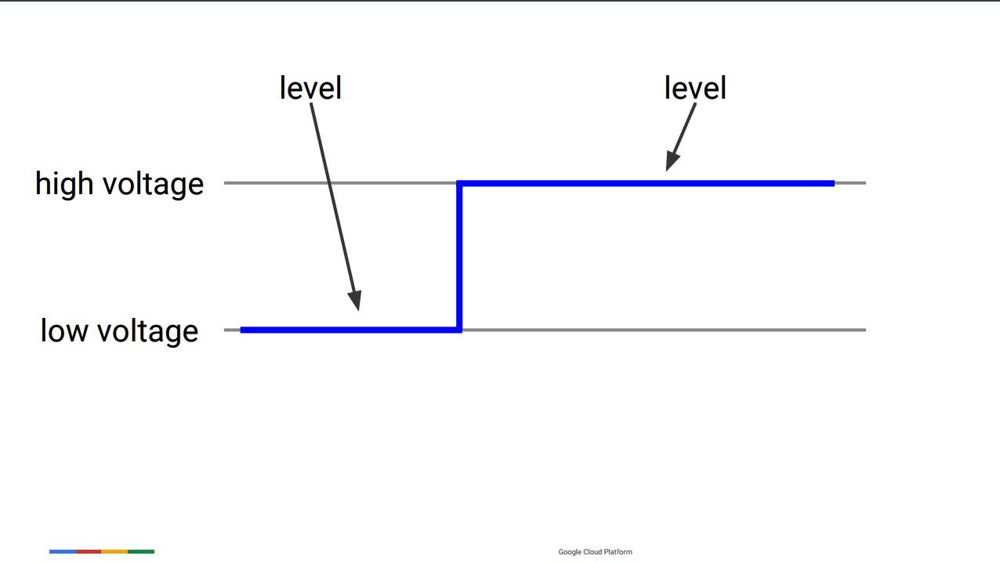

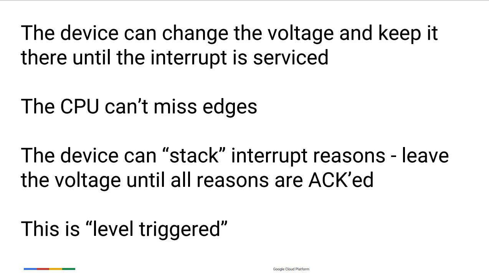

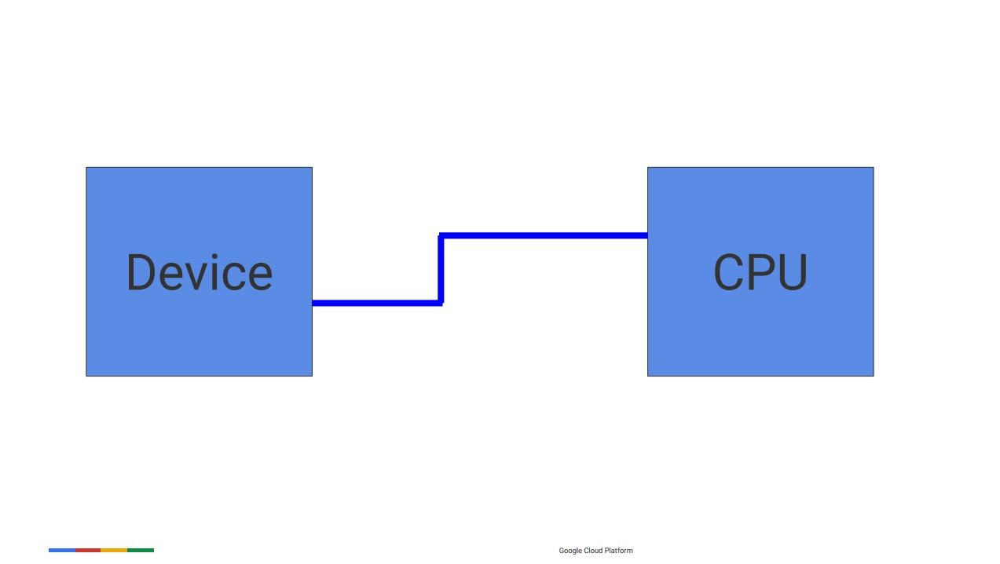

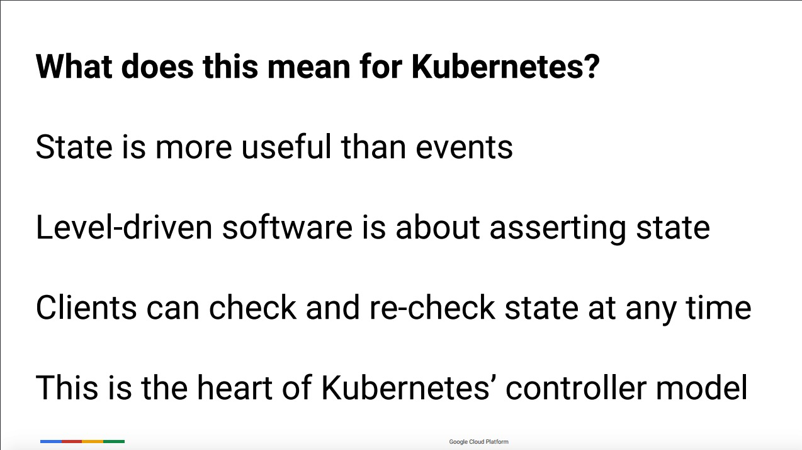
