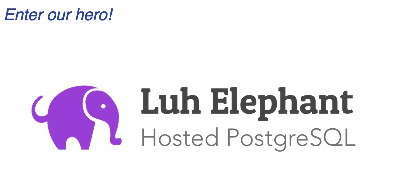

如何计算Kubernetes节约的成本
===================================

##### 简介
-----------------------------------

在本系列中，我们涵盖了一些可以通过容器和Kubernetes管理解决的重要业务话题。 我们谈论了[一个企业如何能够省钱](https://supergiant.io/blog/supergiant-packing-algorithm-unique-save-money)，回答了[为什么您的架构对您的底线很重要](https://supergiant.io/blog/how-to-make-containers-that-scale)，而且，我们还讨论了[如何使用Kubernetes和Supergiant](https://supergiant.io/blog/top-reasons-businesses-should-move-to-kubernetes-now)让应用向容器化的基础设施迁移过程变得更加容易。

------------------------------------------------------------

今天，我将展示如何计算使用Kubernetes后企业真正节约的成本。

------------------------------------------------------------

我们将累计通过一个配置良好的集群产生的真实的数据。 在我们的示例中，我们将使用Amazon Web Services服务，但是这些数字在许多云提供商中看起来类似。 您还能了解以何种方式可以达到您节省硬件成本的预期。

我将讨论在裸金属，虚拟机和Kubernetes上运行应用程序的成本。 当Kubernetes实施得很好时，其基础设施和支持节省将帮助您的业务降低价格，改善支持，并为您的客户提供更好的性能。

##### 介绍我们的主人公
------------------------------------

让我们设置一个虚构的场景。 Luh Elephant，Inc.是一家小型公司，使用AWS为客户提供按需的PostgreSQL数据库实例，客户对Luh提供的数据库服务非常满意。 然而，完整的实例变得昂贵，价格越来越高，因此客户已经开始关注他们的成本。

##### 开始竞争！
------------------------------------

很多竞争者也开始按需提供Postgre，但是价格更低。Luh Elephant, Inc.怀疑是使用容器、虚拟机器或者魔法的原因，但是他们也注意到竞争者们的糟糕的性能。为了更好的竞争，Luh Elephant想做出改变。

很多客户开始选择更便宜的，所以如何提供有竞争力的价格并且可以符合甚至超越当前的性能标准是一个难题。他们真的可以降低价格并提供顾客喜欢的体验和性能吗？

##### 用数字回答!
------------------------------------

首先，让我们看一下当前Luh Elephant, Inc.使用的基础设施。他们目前有300名顾客，并且前100名顾客使用高价的3服务器集群。在这个例子中所有的服务器都是4核的，而在现实中，客户群将更加多样化，但为了简单起见，先这样假设。

假设AWS m4.xlarge类按需实例，这是Luh Elephant，Inc.当前的硬件每月支出。

| 客户 | 服务器数 | 成本合计 |
|:--:|:--:|:--:|
| 200(一台服务器一组) | 200 | $34,894 | 
| 100(三台服务器一组) | 300 | $52,341 |
| | | $87,235 | 

价格数据：[http://ec2pricing.net](http://ec2pricing.net)

##### 预留实例的定价怎么样？
------------------------------------

预留实例是降低成本的第一步，所以让我们计算一下。

理论上，预留实例在所有的实例上得到“一年，部分预付”定价，Luh Elephant可以降低它们41%的成本，达到$51,110每个月。然而，现实又向他们扔了一个弧线球：因为他们商业的不可预测性，他们不能预测并且为第二年预留所有的实例。

简单的转换到预留实例策略不能足够的降低成本。得到所有的节约成本但还不能解决问题，并且在一些例子中，竞争者的价格仍旧低了50%。即使完美的实施预留实例计划，数学依旧很受限制。

##### 所以，还有什么其他的选择来降低成本？
------------------------------------

一直折磨Luh Elephant的是一个常见的问题，也困扰着很多的机构：每个服务器一个主要的应用。从成本上来讲，当服务器没有很好的被利用或者大部分时间是空闲的时候很令人不安。将更多的应用程序压缩到服务器上以获得更多的价值，如果没有很智能的管理，将会导致各种性能和相邻干扰的问题。

所以，我们需要更好地利用我们支付的硬件，为了达到这个目的，我们有几个选项供选择。

###### 选项1：预置虚拟机
------------------------------------

这对于企业是一个高可行性的选择，所以我会详细解释。随着时间的流逝，预置的硬件可能是提供便宜计算能力最好的方式，然而，它也伴随有一些强大的障碍。运行预置硬件会带来硬件的花销，如硬件成本，管理硬件的优秀、高薪的工程师的花销。如果这些障碍不成问题，预置就是目前为止最好的解决办法了。

预置解决办法的准确节约的数字很难计算，因为节约的成本完全取决于执行。从经验来讲，我们希望Luh Elephant可以将基础设施成本降到$20,000每个月。但是记住这不包括额外的工程师工资，而且也不算前期资本支出。初始支出将很高，因为新硬件将需要预先购买。

对于没经验的公司，选择1不适合，至少还要很多年。他们没有资金去支付预置款，并且他们只有10名员工（在最初可能还没有这么多）。找到更加有才华的可能要花费几个月，这在他们竞争的市场中不是一个选择。

###### 选项2：使用一个集群管理工具
------------------------------------

硬件集群管理工具（如Mesos等）是很好的工具，但是它们不能解决“我想让我的应将更高效”的问题。虽然它们有助于减少高效运行大规模生产应用程序所需的知识，但是扩容管理是需要手工操作的，容易造成人为事故。此外，这些系统不会降低硬件支出，有可能会增加硬件支出。

然而，亲爱的读者，不要焦躁，我们还有一个选择。

###### 选项3：用Kubernetes容器化
------------------------------------

这对于我们的主人公是最完美的选择！在我们第一篇关于用Kubernetes节约资金的文章中，您可以很清楚的看到Kubernetes管理的资源种类。Kubernetes满足了想要统治他们的市场的、缺乏资金的公司的所有的要求。而且它不需要牺牲性能或用户体验。

另一个可能的选择是使用非Kubernetes的容器管理器。 这可能节省一点成本，但Kubernetes是目前唯一的有能力并做好动态分配资源的容器管理器。

##### 所以，Kubernetes解决办法转化成现金是多少呢？
------------------------------------

让我们分开来算。我们从之前的文章中知道您可以在Kubernetes中保守的设计一个资源规划，可以使您在硬盘中增加50%的资源消耗，并且这也是可以调节的。每个模块可以找到合适的比率使它最好的适用于它的应用，并且有令人满意的节约成本。50%-80%对于大多数状态性的应用是一个合适的开始。

| 客户 | 服务器数 | 旧方案成本合计 | Kubernetes成本合计
|:--:|:--:|:--:|:--:|
| 200(一台服务器一组) | 200 | $34,894 | $17.447 |
| 100(三台服务器一组) | 300 | $52,341 | $26.171 |
| | | $87,235 | $43.618 |

这就是我们所说的！这是一笔不错的节约。并且现在服务器计数更加可以预测了。我们真的可以比预留实例得到更好地使用：$25,605 (三年从41% 到大约 60%)。

用这种节约成本的方式，Luh Elephant, Inc.公司可以大幅度的降低价格，甚至比竞争者的价格更低，而且还是一样的性能！

这种基础设施模型还有一个额外的好处就是Luh Elephant, Inc.如果选择，现在可以使用甚至更大的实例了。在相同的AWS实例等级使用更大的实例，对于服务器成本几乎无影响，但是将会使他们的客户访问高价值的云功能，例如非常高的网络流通量，更高的存储速度和突发性。如果一个或多个用户临时超出了他们的使用限额，更大的实例可以提供更多的空间。所有的这些都使这家创业公司获得更多的其他竞争者可以提供的优势。

##### Supergiant在哪里开始发挥作用？
------------------------------------

Kubernetes有时会令人畏惧，因此我们开发了Supergiant，让它在Kubernetes之上运行，它不会让Kubernetes 更难掌握—— 它只是将深层的Kubernetes功能带到表面，并使它们易于管理。

#### 致谢与参考文献
------------------------------------

* 原文链接：https://supergiant.io/blog/how-to-calculate-kubernetes-cost-savings

* 作者： Mike Johnston

##### 扩展阅读
------------------------------------

* [Kubernetes Series: Understanding Why Container Architecture is Important to the Future of Your Business](https://supergiant.io/blog/how-to-make-containers-that-scale)

* [Top Reasons Businesses Should Move to Kubernetes Now](https://supergiant.io/blog/how-to-calculate-kubernetes-cost-savings)

* [Why Is the Supergiant Packing Algorithm Unique? How Does It Save Me Money?](https://supergiant.io/blog/supergiant-packing-algorithm-unique-save-money)

* [How Qbox Saved 5 Figures A Month With Supergiant](https://supergiant.io/about)

