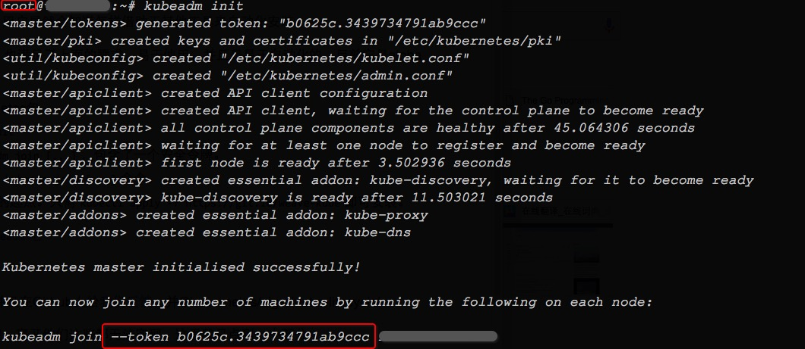
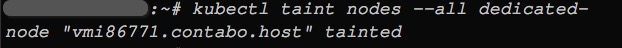
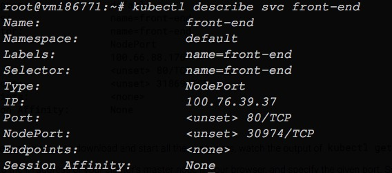

五分钟快速安装Kubernetes1.4集群
=======================================

一直以来，安装、部署Kubernetes集群对用户来说都是件头疼的事，官方自带的kubeup脚本容易让人迷惑，手工安装又容易出错。

[SIG-Cluster-lifecycle](https://github.com/kubernetes/community/blob/master/sig-cluster-lifecycle/README.md)最近为社区贡献了一款致力于简化Kubernetes安装的工具——kubeadm。

他们编写kubeadm工具的初衷：

> 我们之前收到用户的反馈说Kubernetes的安装非常困难，同时我们希望人们能够专注于编写优质的分布式应用而不用被基础设施所困扰。所以SIG-Cluster-lifecycle](https://github.com/kubernetes/community/blob/master/sig-cluster-lifecycle/README.md)近来一直在`kubeadm`上努力，`kubeadm`可以让Kubernetes的安装变得惊人的简单。

下面是安装Kubernetes集群的几个步骤：
-----------------------------------------------------------

* 准备: 准备一些机器，安装较新版本的操作系统(本文以ubuntu16.04为例)

* 启动：在集群上安装docker和Kubernetes

* 附件：安装Kubernetes集群必要的插件，如DNS和监控服务


众所周知，用户在准备机器时有很多选择，可能来自不同的云服务商、私有云、裸金属甚至树莓派，通常有他们自己偏爱的自动化部署工具：Terraform、CloudFormation、Chef、Puppet、Ansible甚至用来启动裸金属的PXE等等。所以我们做了一个重要的决定：kubeadmin 不设计机器（计算节点）的准备。唯一的要求是它假定用户已经拥有了一些运行Linux的机器。


### 启动
-----------------------------------------------------------

####  安装docker, kubeadm和kubelet
-----------------------------------------------------------

```bash
curl https://packages.cloud.google.com/apt/doc/apt-key.gpg | apt-key add -

cat <<EOF > /etc/apt/sources.list.d/kubernetes.list
deb http://apt.kubernetes.io/ kubernetes-xenial main
EOF

apt-get install apt-transport-https

apt-get update

apt-get install -y docker.io kubelet kubeadm kubectl kubernetes-cni
```


#### 初始化Master节点
-----------------------------------------------------------

```bash
kubeadm init
```

执行过程如下图所示：



Master节点初始化的过程中，集群创建用于Master和Node节点通信的令牌。


#### 将机器加入集群
-----------------------------------------------------------

如果想加入集群，执行`kubeadm join`命令即可加入到Kubernetes集群中:

```bash
kubeadm join --token <token> <master-ip>
```

#### 让Master也参与计算调度
-----------------------------------------------------------

让Master也接受来自集群的调度请求（Master节点同时也是Node节点)，只需执行一个命令：

```bash
kubectl taint nodes --all dedicated-
```



#### 安装Pod网络
-----------------------------------------------------------

为了让Pod之间彼此通信，您需要部署一个网络组件，现有很多Pod间通信的组件，例如[Calico](https://github.com/projectcalico/calico-containers/tree/master/docs/cni/kubernetes/manifests/kubeadm), [Flannel)(https://github.com/coreos/flannel), [Weave](https://www.weave.works/)等，本文使用Weave组件作为Pod网络插件：

```bash
kubectl apply -f https://git.io/weave-kube
```


#### 安装必要插件
-----------------------------------------------------------

安装Kubernetes集群的监控组件——heapster

```bash
git clone https://github.com/lth2015/heapster.git

cd heapster/deploy

./kube.sh
```

安装过程需要几分钟，这跟您的网络环境有关（由于众所周知的原因，这些镜像需要翻墙）。

您要等待heapster安装完成后才能继续下面的安装，您可以通过下面命令监控heapster是否安装成功：

```bash
watch "kubectl get pods --namespace=kube-system"
```

#### 安装Dashboard
-----------------------------------------------------------

在Kubernetes 1.4发布时，Dashboard 也同时发布，Dashboard较早起版本有了更加丰富的内容和可视化统计图表。您可以

```bash
kubectl create -f https://rawgit.com/kubernetes/dashboard/master/src/deploy/kubernetes-dashboard.yaml
```

安装完Dashboard后，您可通过http://$master:8080/ui来访问:


#### 使用Kubernetes集群
-----------------------------------------------------------

我们准备了一个微服务的例子，它是一个电子商务网站——袜子商店，它的源码在[GITHUB](https://github.com/microservices-demo/microservices-demo)。

使用Kubernetes创建微服务：

```bash
git clone https://github.com/microservices-demo/microservices-demo

kubectl apply -f microservices-demo/deploy/kubernetes/manifests
```



通过[NodePort](http://kubernetes.io/docs/user-guide/services/)方式访问在线袜子商店的服务：


*我们为这个安装教程制作了视频*


#### 参考文献及致谢
-----------------------------------------------------------

* [Installing Kubernetes on Linux with kubeadm](http://kubernetes.io/docs/getting-started-guides/kubeadm/)

* [How we made kubernetes easy to install](http://blog.kubernetes.io/2016/09/how-we-made-kubernetes-easy-to-install.html)

* [我们是如何让K8s“巨易”安装的](https://github.com/maxwell92/TechTips/blob/master/EnTechDoc/k8s-how-we-made-k8s-insanely-easy-to-install/README.md)

* 感谢Luke Marsden、Weaveworks和SIG-Cluster-lifecycle，感谢他们为社区带来这么好的工具。

* 感谢苗立尧（@maxwell92)同学的翻译。

