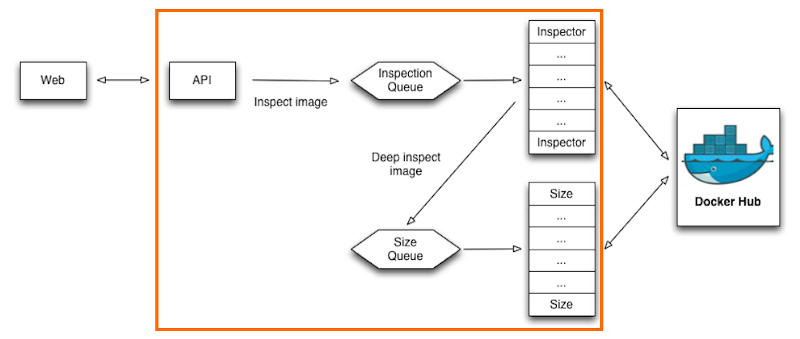
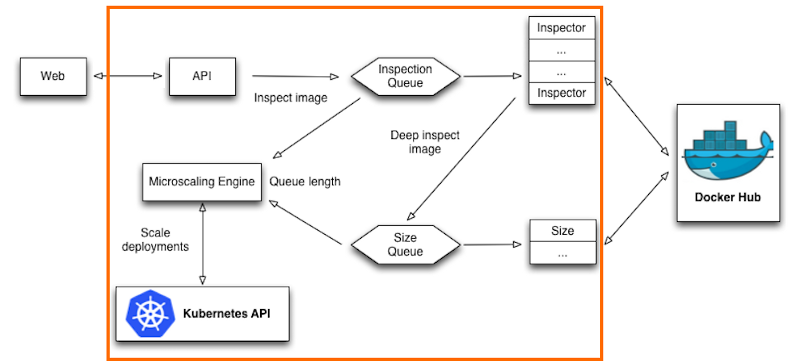

在生产环境中使用Kubernetes部署可编程的基础设施
======================================================
原文链接：[Programmable Infrastructure in Production with Kubernetes](https://medium.com/@anne_e_currie/programmable-infrastructure-in-production-with-kubernetes-5d236cceb91d#.5y13rq124)

> 这周我们聊聊自动化的与可编程的基础设施并且列举一个真实的例子。我们将继续使用*Mircobadger*服务，通过我们自己定义的调度器实现部分自动化。我们调度程序的代码是开源的，可以从[https://github.com/microscaling/microscaling](https://github.com/microscaling/microscaling)上获取。它可以使用*Kubernetes*的*Deployment API*来扩展。

### *Microbadger*做什么
------------------

*Microbadger*是个*SaaS*服务，可以让您浏览*Docker Hub*上的任何公共镜像的元数据。您提供镜像的名称，我们会从*Docker Hub*获取数据，整理并显示出来。

### *Microbadger*如何工作
------------------

想象一下，用户请求一个尚未缓存的新镜像，有很多我们需要获取和显示的数据。虽然*Docker Hub*在大多数请求时都很快的返回，但某些时候却需要很长时间，尤其是进行获取镜像深度信息(*Inspect*)的时候，比如获取下载镜像的大小和向工程师展示镜像的分层信息。

我们决定尽快显示内容以保持客户的使用体验，只要涉及缓慢的过程，我们可以通过分开数据请求和处理来加速这个过程。

所有的内容都展示在下图的橘色框内：

* 容器化，无状态化，并在*Kubernetes*或*AWS*集群中编排

* 一个*AWS*服务SQS，用户队列服务

它主要由三个部分组成：

* *API*服务(*Go*)处理来自网络的*API*请求，并提供缓存的内容，或者在检查队列上删除新数据的请求。*Web*客户端轮询*API*直到请求完全完成。

* 一个单线程执行*Inspector*服务(*Go*)，轮询*Inspection*队列获取新的任务，从*Docker Hub*请求快速数据。它处理和缓存响应，并且还会把较慢数据的请求放在*Size*队列上。

* 一个单线程执行*Size*服务(*Go*)，轮询*Size*队列获取新的任务和请求，从*Docker Hub*请求较慢的数据，处理和缓存请求。

每个*Go*程序都是单线程的，我们通过运行更多的*Pod*来弹性扩展，每个Pod中只包含一个容器。*Size*服务和*Inspector*服务共享物理的基础设施，它们都运行在相同的*AWS*的基础设施和节点上。

起初，我们在两个*AWS T2*实例上运行10个*Inspector*的*Pod*和10个*Size*的*Pod*，虽然容易，但有些乏味，过度的配置超出了大多数时间处理峰值的需求。我们可以不可以使用一个可编程的基础设施，来帮我们节省一些成本？

### *Microbadger*主要特性
------------------

* *API*服务至关重要，所以要能过快速的弹性扩展

* *Size*服务也是至关重要的。我们通过使用云队列服务来处理，这是非常昂贵的。*Size*队列服务用于保存状态，使*Kubernetes*集群无状态，这让应用更容易配置。

* *Inspector*服务对于新的镜像是迫切需要的，这对于我们宝贵的新用户是至关重要的。

*Size*服务不是那么紧急——如果它一段时间不可用，*Microbadger*将不会很好，但是仍然可以正常工作。

### 理想的可编程基础设施
------------------

这个相当标准的架构非常适合一可编程的方式进行优化和演进。为此，*Microbadger*使用我们为*Kubernetes*自定义的调度器，它需要三个输入：

* 需求度量，在这种情况下，我们使用了两个队列的长度

* 高优先级服务（容器标识符），用于*Inspector*服务

* 低优先级服务（容器标识符），用于*Size*服务

自定义的调度器只需创建*Inspector*服务的容器，直到满足主要的需求指标（*Inspector*未备份）。通过杀死*Size*服务的容器（记住他们共享相同的机器），从而释放空间。当*Inspector*队列长度下降是，自定义调度程序将关闭部分*Inspector*服务，并启动足够的*Size*服务的容器以保持*Size*服务恢复正常进行。

这种可编程的基础设施有几个很好的特性：

* 它确保我们仅运行最少数量的服务，这将我们的昂贵的成本：SQS轮询操作较少了大约70%。

* 它减少了我们大量使用的资源总量，这有可能在以后多租户集群中减少我们的账单。

### 背后的哲学
------------------

节省成本是好的，但是我们感兴趣的是理念的转变。在单一的应用中，所有这些组件都将在一个巨大的服务内部，这可能会在内部完成所有这些自定义的调度（监视内部队列和启动/停止线程）。我们需要将一个庞大的单体应用，拆分成微服务的应用。

我们将服务拆成微服务的原因：

* 更加容易部署和管理，可以持续交付的小组件 + *API* + 小团队 + 减少冲突，这些可以与*Kubernetes*的滚动部署天然的结合。

* 劳动分工，专业的人员提供专业的服务，可以提高第三方服务的质量和效率（例如：*SQS*服务）

然而，*Mircoservices*的缺点是失去了可以构建成一个整体的、无所不知的内部视图和控制，这通常意味着过度供应。现在，自定义的调度器和编排器，我们杜绝了过度供应的可能。

*Mircoservices*可以是一个非常好的架构，使用我们自定义的调度器来获取资源，而无需重构我们的应用，这是非常好的！
