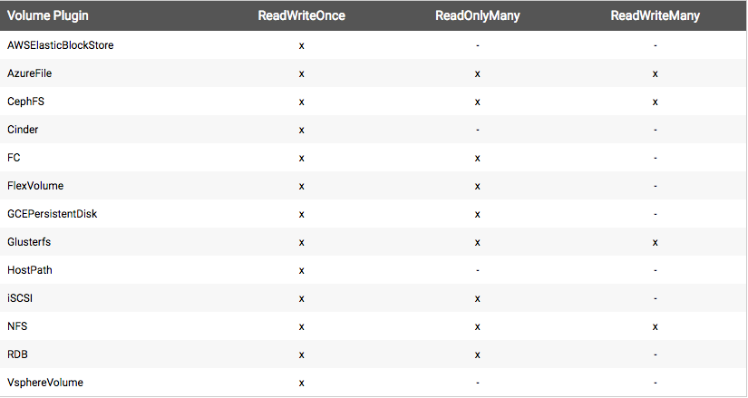

Kubernetes 1.4新特性－－持久卷
====================

### 简介
-----------------

译者注：这里介绍了k8s里几个概念PV，PVC，StorageClass与pod node类比:
pod--node--计算集群--计算资源池
pvc--pv--存储集群--存储资源池

本文描述了目前kubernetes中持久卷（PersistentVolume）的情况，建议先熟悉卷（Volume）的概念。
在云环境下，存储资源管理和计算资源管理有区别。持久卷（PersistentVolume）子系统提供了API，屏蔽了底层的细节，用户和管理员不用关心存储如何提供，如何消耗等，为此，我们在kubernetes 1.4中引入了两个新的API资源(kind)：PersistentVolume和PersistentVolumeClaim 

#### 持久卷(PV)
-----------------

通常我们把存储做成集群，对外表现为一个网络存储，持久卷（PV）是这个资源中的一个片段，就像node和cluster的关系。PV是跟Volume一样是卷插件【详见[Kubernetes Volume概念](http://kubernetes.io/docs/user-guide/volumes/)】，但其生命周期不依赖任何单个的pod，底层存储实现可以是NFS，iSCSI，云存储等，都通过API对象对外暴露，对用户透明。

#### 持久卷请求(PVC)
-----------------

用户通过持久卷请求（PersistentVolumeClaim－－PVC) 申请存储资源，PVC vs PV可以类比pod和node的关系，pod会消耗node的资源，PVC消耗PV的资源。pod可以申请计算资源的粒度（CPU、内存),PVC 可以申请大小、访问方式（例如mount rw一次或mount ro多次等多种方式）

#### 存储级别
-----------------

经过API抽象，用户可以通过PVC使用存储资源，通常用户还会关心PV的很多属性，例如对不同的应用场景需要不同的性能，仅仅提供存储大小和访问模式不能满足要求。集群管理员一方面要提供不同PV的多种属性，一方面要隐藏底层的细节，就引入了StorageClass资源。

管理员用存储级别StorageClass描述存储的分类，不同的分类可以对应不同的质量服务Qos等级、备份策略和其他自定义的策略。kubernetes本身不参与存储级别的划分，StorageClass概念在有的存储系统里被称为"profiles"。

如果想尝试PersistentVolumeClaim，请点击[详细案例](http://kubernetes.io/docs/user-guide/persistent-volumes/walkthrough/)。

### 生命周期
-----------------

PV是集群的资源，PVC请求资源并检查资源是否可用，PV和PVC生命周期如下：

#### 资源提供
-----------------

包含静态和动态两种提供方式

##### 静态
-----------------

存储集群先创建一定数量的PV，PV包含了真实存储的底层细节，用户通过kubernetes API使用存储。

##### 动态
-----------------

在现有PV不满足PVC的请求时，管理员可以使用依据存储分类(StorageClass)，描述具体过程为：PV先创建分类，PVC请求已创建的某个类的资源，这样就达到动态配置的效果。请求类有效的禁止了动态配置自己。

##### 绑定
-----------------

用户根据所需存储空间大小和访问模式创建（或在动态部署中已创建）一个 PersistentVolumeClaim。Kubernetes的Master节点循环监控新产生的PVC，找到与之匹配的PV（如果有的话），并把他们绑定在一起。动态配置时，循环会一直将PV与这个PVC绑定，直到PV完全匹配PVC。避免PVC请求和得到的PV不一致。绑定一旦形成，PersistentVolumeClaim绑定就是独有的，不管是使用何种模式绑定的。

如果找不到匹配的volume，用户请求会一直保持未绑定状态。在匹配的volume可用之后，用户请求将会被绑定。比如，一个配置了许多50Gi PV的集群不会匹配到一个要求100Gi的PVC。 只有在100Gi PV被加到集群之后，这个PVC才可以被绑定。

##### 使用
-----------------

Pods 使用Claims做为volumes。集群检查Claim，查找绑定的volume，并为Pod挂载这个volume。对于支持多访问模式的volume，用户在Pod中使用Claim时可指定自己想要的访问模式。

用户一旦有了Claim，并且被绑定，那么被绑定的PV将一直属于该用户。用户可通过在Pod volume块中包涵PersistentVolumeClaim的方式来调度Pods，并访问他们所要求的PV。

##### 释放
-----------------

当用户使用完volume后，可以从API中删除PVC对象，这样资源就可以被回收了。Claim被删除之后，volume被认为是‘释放’状态，但它还不能被其它claim使用。之前使用者的数据还保留在volume上，这个必须按一定策略进行处理。

##### 回收利用
-----------------
PersistentVolume的重用策略将告诉集群在volume被释放之后该如何进行处理。volume被释放后可用保留，回收或删除。保留支持手工重分配资源。

删除（需要volume插件支持），支持从Kubernetes中删除PersistentVolume对象，并支持从外部设施中（比如AWS EBS, GCE PD or Cinder volume）删除对应的存储资源。动态部署的volumes会被直接删除。

回收（需要volume插件支持），可对volume执行基本的删除操作(rm -rf /thevolume/\*) ，并使它对新的claim可用。

### 持久存储的种类
-----------------

kubernetes通过插件支持下列存储：

* GCEPersistentDisk

* AWSElasticBlockStore

* AzureFile

* FC (Fibre Channel)

* NFS

* iSCSI

* RBD (Ceph块设备)

* CephFS

* Cinder (openstack的快存储)

* Glusterfs

* VsphereVolume

* HostPath (只能用于单节点)

#### 持久卷(PV)
-----------------

每个PV定义中包含spec和status，下面是一个简单的例子：

```yaml
apiVersion: v1
kind: PersistentVolume
metadata:
  name: pv0003
  annotations:
    volume.beta.kubernetes.io/storage-class: "slow"
spec:
  capacity:
    storage: 5Gi
  accessModes:
    - ReadWriteOnce
  persistentVolumeReclaimPolicy: Recycle
  nfs:
    path: /tmp
    server: 172.17.0.2
```

#### 容量
-----------------

一般来说，PV通过capacity属性定义容量大小。可以通过查看Kubernetes[资源模型](https://github.com/kubernetes/kubernetes/blob/master/docs/design/resources.md)理解容量需求。

目前仅支持容量大小，将来会包括iops，吞吐量等属性

#### 访问方式
-----------------

存储有很多种，每种存储又有自己的特性，PV访问不同的存储会有不同的访问方式，例如NFS支持多个rw的客户端，但具体到NFS PV可能会用只读方式export。对不同PV的特性，每个PV有自己的访问方式。

访问方式包括：

* ReadWriteOnce – 被单个节点mount为读写rw模式

* ReadOnlyMany – 被多个节点mount为只读ro模式

* ReadWriteMany – 被多个节点mount为读写rw模式

在CLI下，访问方式被简写为：

* RWO - ReadWriteOnce

* ROX - ReadOnlyMany

* RWX - ReadWriteMany

*重要*的是，在同一时刻，一个卷只能使用一种访问方式mount，例如GCEPersistentDisk被可以一个节点mount为ReadWriteOnce也可以被多个节点mount为ReadOnlyMany，但不能同时做。

下图列举了Kubernetes支持的存储插件的访问方式:




#### 分类
-----------------

PV分类通过设置注释volume.beta.kubernetes.io/storage-class定义StorageClass的名称。一个特定的PV分类与PVC请求绑定。PV没有注释或注释为””表示没有分类，只能绑定到通用PVC。

未来正式版，volume.beta.kubernetes.io/storage-class注释会成为属性。

#### 回收策略
-----------------

现有回收策略有：

* Retain – 手动重新使用

* Recycle – 基本的删除操作 (“rm -rf /thevolume/\*”)

* Delete – 关联的后端存储卷一起删除，后端存储例如AWS EBS, GCE PD或OpenStack Cinder

目前只有NFS和HostPath支持回收，AWS EBS, GCE PD和Cinder volumes只支持删除

#### 卷的状态
-----------------

卷有四种状态，一个卷必属于其中之一:

* Available –闲置状态，没有被绑定到PVC

* Bound – 绑定到PVC

* Released – PVC被删掉，资源没有被在利用

* Failed – 自动回收失败

CLI会显示绑定到PV的PVC名。

#### 持久卷请求(PVC) 
-----------------

PVC包涵spec和status:

```yaml
kind: PersistentVolumeClaim
apiVersion: v1
metadata:
  name: myclaim
  annotations:
    volume.beta.kubernetes.io/storage-class: "slow"
spec:
  accessModes:
    - ReadWriteOnce
  resources:
    requests:
      storage: 8Gi
  selector:
    matchLabels:
      release: "stable"
    matchExpressions:
      - {key: environment, operator: In, values: [dev]}
```

#### 访问方式
-----------------

PVC使用特定的访问方式式请求存储资源，并统一约定为卷。

#### 资源
-----------------

PVC可以像pod一样申请一定数量的资源，不过申请的是存储资源，kubernetes的资源模型同样适用于卷和PVC.

#### 选择器
-----------------

PVC可以指定一个标签选择器来进一步过滤卷集，只有匹配的的卷标签会被绑定到PVC，Selector包涵2项内容：

* matchLabels - 匹配标签，卷标签必须匹配某个值

* matchExpressions - 匹配表达式，由键值对，操作符构成，操作符包括 In, NotIn, Exists, 和 DoesNotExist.

所有请求，必须全部满足matchLabels 和 matchExpressions的定义

#### 分类
-----------------

PVC可以用特定的StorageClass名称，通过volume.beta.kubernetes.io/storage-class注释请求特定的PV分类。PV和PVC注释一致时，才能绑定。

PVC请求可以不带分类。PVC的注释为空“”表示此请求没有分类要求，所以只能被绑定到没有分类的PV（没有注释或注释为空“”）。集群有一个DefaultStorageClass准入插件的开关决定了无类PVC是否相同。

如果准入插件打开，管理员会指定一个缺省的存储类型StorageClass，所有无类PVC会被绑定到缺省PV， 把storageclass.beta.kubernetes.io/is-default-class 设置为“true”，就打开了缺省StorageClass。当没有缺省PV或is-default-class为false或缺省PV不唯一，准入插件会禁止创建PVC。

如果准入插件关闭，就没有缺省StorageClass的概念了。无类PVC只能被绑定到无类的PV，这样无类PV和PV注解为空""是一样的。

当PVC指定Selector请求StorageClass，所有请求做与连接：只有PV类和标签都符合请求才能绑定到PVC。需要注意，目前具有非空选择器的PVC不能使用动态配置的PV

未来正式版，volume.beta.kubernetes.io/storage-class注释会成为属性。

#### 把PVC用做卷
-----------------

pods 通过将PVC当做volume来访问存储。在pod使用PVC时，PVC必须存在于相同的namespace下。集群在pod的namespace中找到PVC，并用它获取支持PVC的PV。之后,volume将会被加载至host和pod中。

```yaml
kind: Pod
apiVersion: v1
metadata:
  name: mypod
spec:
  containers:
    - name: myfrontend
      image: dockerfile/nginx
      volumeMounts:
      - mountPath: "/var/www/html"
        name: mypd
  volumes:
    - name: mypd
      persistentVolumeClaim:
        claimName: myclaim
```

#### Namespaces注意事项
-----------------

PV的绑定是独占式的，而且因为PVC是namespace的对象，所以mount多种模式（ROX, RWX）的PVC只在同一namespace中。

#### 存储级别
-----------------

每个StorageClasse都包括provisioner和parameters字段。当属于class的PV需要动态提供时，他们会被派上用场。

StorageClass对象的名字非常重要，决定着用户该如何请求一个特定的class。在第一次创建StorageClass对象时，要设置class的名字和其他参数。对象一旦创建将无法更新。

管理员可单独为不需要绑定任何class的PVCs定义一个默认的StorageClass。详细请参考PersistentVolumeClaim部分。

```yaml
kind: StorageClass
apiVersion: storage.k8s.io/v1beta1
metadata:
  name: standard
provisioner: kubernetes.io/aws-ebs
parameters:
  type: gp2
```

#### Provisioner
-----------------

storage classes的provisioner字段决定着哪个volumn插件被用来部署PV。这个字段必须指定。在beta版本中，可用的provisioner类型有 kubernetes.io/aws-ebs 和 kubernetes.io/gce-pd。

#### Parameters
-----------------

Storage classes 的parameter字段用来描述属于该storage class的volume。不同的provisioner其参数也不同。比如说，io1对应type参数；iopsPerGB则被指定给EBS。当参数未被指定时，会用到一些缺省值。

#### AWS
-----------------

```yaml
kind: StorageClass
apiVersion: storage.k8s.io/v1beta1
metadata:
  name: slow
provisioner: kubernetes.io/aws-ebs
parameters:
  type: io1
  zone: us-east-1d
  iopsPerGB: "10"
```

* type: io1, gp2, sc1, st1. 详细请参考 AWS docs for details. 缺省: gp2.

* zone: AWS zone. 如果未指定，将从Kubernetes cluster 节点所在的zone中随机选取一个。

* iopsPerGB: 只对 io1 volumes。每秒每GiB的I/O操作。AWS volume 插件将这个值乘以所请求的volume大小来计算该volume的IOPS ，最大值为20000 IOPS（AWS所支持的最大值，参考AWS docs. 该字段为字符格式，即 “10”，非 10）
encrypted: 指定EBS volume是否应该被加密。合法的值为 "true" or "false". 该字段为字符格式，即 “true”，非 true.

* kmsKeyId: 可选。当volume被加密时 Amazon Resource Name全名会被使用。如未指定，但 encrypted 是 true时，AWS会生成一个key值。 请参考 AWS docs 有效ARN值。

#### GCE
-----------------

```yaml
kind: StorageClass
apiVersion: storage.k8s.io/v1beta1
metadata:
  name: slow
provisioner: kubernetes.io/gce-pd
parameters:
  type: pd-standard
  zone: us-central1-a
```

* type: pd-standard 或 pd-ssd. 缺省: pd-ssd

* zone: GCE zone。 如未指定，将从控制管理器所在的区域中随机选取一个zone。

#### GLUSTERFS
-----------------

```yaml
apiVersion: storage.k8s.io/v1beta1
kind: StorageClass
metadata:
  name: slow
provisioner: kubernetes.io/glusterfs
parameters:
  endpoint: "glusterfs-cluster"
  resturl: "http://127.0.0.1:8081"
  restauthenabled: "true"
  restuser: "admin"
  restuserkey: "password"
```

* endpoint: glusterfs-cluster 是 endpoint/service 名字，包括 GlusterFS 信任的IP地址池。这个参数是必须的。

* resturl : Gluster REST 服务 url，它按需部署gluster volumes。格式应为 http://IPaddress:Port 。当使用GlusterFS dynamic provisioner时，这个参数是必须的。

* restauthenabled : 布尔值，用于指定REST服务器上的Gluster REST 服务认证是否启用。如该值为”true”，你必须为‘restuser’ and ‘restuserkey’ 参数赋值。

* restuser : Gluster REST 服务用户, 用户可以在Gluster 信任池中创建volume。

* restuserkey : Gluster REST 服务用户的密码, 用于REST 服务器认证。

#### OpenStack Cinder
-----------------

```yaml
kind: StorageClass
apiVersion: storage.k8s.io/v1beta1
metadata:
  name: gold
provisioner: kubernetes.io/cinder
parameters:
  type: fast
  availability: nova
```
* type: Cinder中创建的VolumeType . 缺省为空。

* availability: 可用的Zone。缺省为空。

#### 可移植配置
-----------------

如果你在为一个大规模集群编写配置模板或样例，并且需要持久存储，我们建议你使用以下模式：

* 在配置组合中一定包涵PersistentVolumeClaim对象（以及Deployments, ConfigMaps等）

* 一定不要在配置中包涵PersistentVolume对象，因为使用配置的用户也许没有权限创建PersistentVolumes.

* 当创建模板时，让用户可选择是否提供storage class名字

* 如果用户提供了storage class名字，并且集群版本是1.4或以上，把这个值放到PVC volume.beta.kubernetes.io/storage-class的注释中. 如果集群的StorageClasses已被管理员启用，这会使PVC寻找匹配合适的StorageClass。

	* 如果用户未提供StorageClass名字，或集群版本是1.3，那就在PVC中加入volume.alpha.kubernetes.io/storage-class: default注释。

	* 这会使PV对一些集群中有默认特性的用户进行自动部署，尽管名字显示alpha，这个注释的后台是beta级别的支持。

	* 不要给volume.beta.kubernetes.io/storage-class: 赋予任何值，包括空值。因为它会阻止DefaultStorageClass 的准入控制器执行（如果已经启用了的话）。

* 一定要使用监视那些经过一段时间后未被绑定的PVC，并反馈给用户。因为这或许表明该集群没有动态存储支持（这种情况下用户应该创建一个匹配的PV），或者该集群没有存储系统 （这种情况下用户不能够部署配置来请求PVC）。

* 未来我们期待更多的集群启用DefaultStorageClass，并且有各种存储可用。然而，也许没有什么storage class的名字可适用于所有集群，所以不要设置默认名字。到某个阶段后，alpha注释将失去意义，但PVC上未赋值的storageClass字段将会达到预期的效果。


#### 原文链接
-----------------

http://kubernetes.io/docs/user-guide/persistent-volumes/
