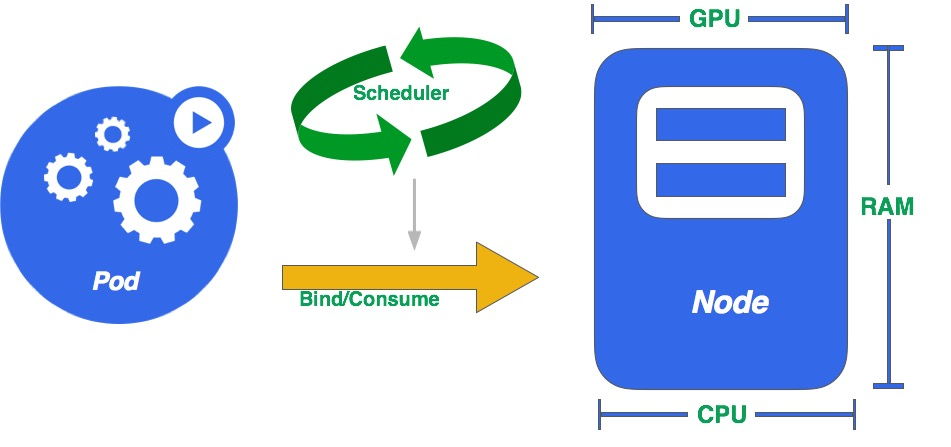
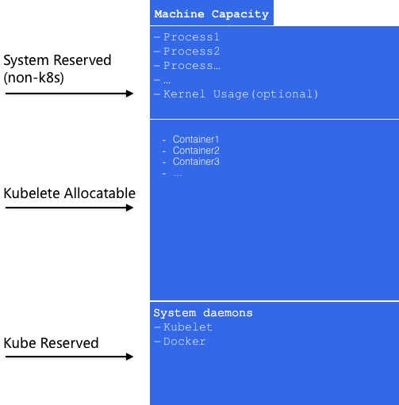
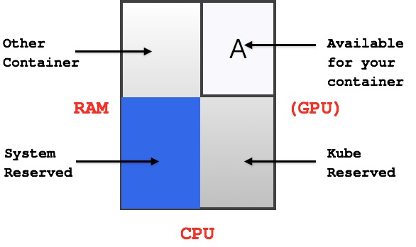
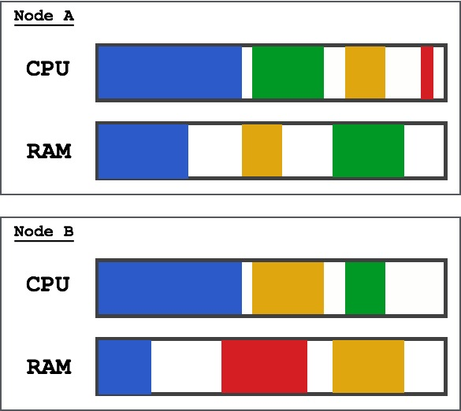
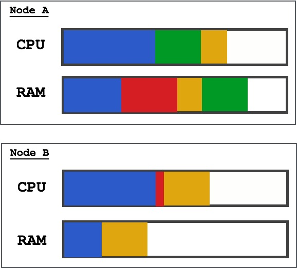
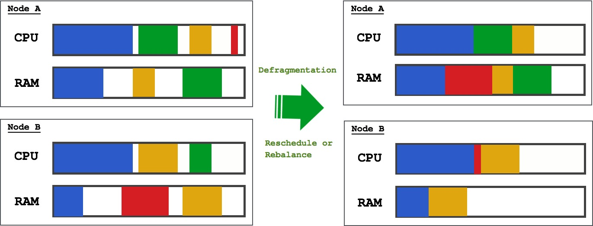

Kubernetes计算资源模型
===========================

Kubernetes的资源模型的理解对Kubernetes的使用者至关重要，它不仅关系到基础设施和资源的使用率优化，还关系到生产环境中Kubernetes集群的稳定性。

本文我们将一起探讨Kubernetes的资源模型的设计，以及我们如果利用资源模型来提高我们资源的使用率。

### 预热
--------

*在介绍资源模型之前，我们先来简单介绍一下Kubernetes的几个主要概念：*

* Node：计算节点，用来提供计算资源实体，可以理解为物理机、云主机、虚拟机等。

* Pod：Kubernetes调度容器的基本单位，Pod中包含一个或者多个容器，每个Pod最终会被调度到Node上，消费Node上提供的计算资源。

* Scheduler：Kubernetes将用户创建Pod的请求提交给Scheduler调度器，Scheduler决定Pod最终被调度到哪个Node上。

如图-1所示，Pod经过Scheduler调度，绑定到某个Node上，消费该Node提供的计算资源:




### 资源分类、抽象与表示
----------

在介绍资源模型之前，我们先介绍一下什么是**“资源”**。

对于一个Kubernetes Node（物理机、虚拟机、云主机）所提供的资源，主要分为三大类：计算资源、网络资源，存储资源。

显然这个粒度的分类对我们使用资源没有帮助，我们需要更加细分和量化这些资源，才能在系统中更好的进行资源分配和调度。

####  资源分类
----------

在计算机体系中，可以被称为"资源"的可以列举很多：

 * CPU
 * 内存
 * GPU
 * 磁盘空间(Disk space)
 * 磁盘时间(Disk time)
 * 网络带宽
 * 端口号
 * 高速缓存
 * IP地址
 * PIDs
 * ...

通常，我们称CPU、GPU、内存等为计算资源，它们大体上又可分为两类：可压缩资源和不可压缩资源:

##### 可压缩资源
-----------

可压缩资源有如下特性：

 * 资源本身无状态
 * 申请资源非常快
 * 回收资源几乎不会失败

CPU、GPU属于可压缩的资源，磁盘时间(Disk time)也属于可压缩资源。

##### 不可压缩资源
------------

不可压缩资源有如下特性：

 * 资源本身持有状态
 * 申请资源相对比较慢
 * 回收资源时可能失败

内存、磁盘空间(Disk space)属于不可压缩资源。


#### 资源抽象
------------

##### 不透明整数资源
------------

Kubernetes使用"不透明的整数资源"（*Opaque Integer Resources*）方式来量化和使用计算资源。

对于上面提到的CPU、GPU、Memory、Disk time...等，Kubernetes将他们抽象成整数，而不用关心它的具体细节。

Kubernetes将CPU每个CPU核的计算能力抽象为整数1或者1000m，如果一个Pod申请了CPU为0.5或者500m，这就代表它申请了0.5CPU核。

关于"*Opaque Integer Resources*"资源的讨论：[stackoverflow/the-opaque-integer-resources](https://stackoverflow.com/questions/42330074/how-to-understand-the-opaque-integer-resources-in-kubernetes-resource-model)

#### 资源的表示
----------

对于用户和Kubernetes组件（Scheduler, Auto-Scaler, Auto-Sizer, Load Balancers）都需要知道Pod的资源需求，Node资源能力和资源的使用率。

Kubernetes将Pod的资源需求和Node资源能力通过设定它们的Spec字段实现，资源的使用率通过设置Status字段来实现。

下面的例子说明了如何定义一个Pod的资源需求：

```bash
resourceRequirementSpec: [
  request:   [ cpu: 2.5, memory: "40Mi" ],
  limit:     [ cpu: 4.0, memory: "99Mi" ],
]
```

其中：

 * request: request字段是可选的，代表Pod请求资源的数量，或者已请求和已分配的资源数量。Scheduler的调度算法已经request字段的来度量一个Pod是否适合
 一个Node（Node上足够提供request的资源）。如果一个容器或者Pod尝试使用比request更多的资源，该服务的SLO将得不到保障，在资源短缺的情况下，这种请求会失败。
 如果Request没有设置，那么它默认是limit的值。如果Pod没有设置，那么，request是pod中所有container请求资源的总和。

 * limit: limit字段也是可选的，它代表着容器或者Pod的最大资源使用上限，如果容器或者Pod使用的资源超出这个上限，它会被终止。如果不设置limit，那么意味着Pod
 可以无上限使用资源，这种方式非常危险，在实际生产运维过程中，这种不设置limit会导致不确定的行为，特别是对于内存来说，在生产环境中使用Kubernetes的团队一定要重视这个问题。

**通过设定request和limit可是实现Kubernetes不同级别的QoS和资源超卖，后面会详细讨论**

下面的例子说明Node上总体资源能力的定义：

```bash
resourceCapacitySpec: [
  total:     [ cpu: 12,  memory: "128Gi" ]
]
```

其中：

 * total: Node上所有可申请的资源总量。


##### Kubernetes保留的资源定义
----------

从上面的例子中可以看出，"cpu", "memory"用来作为CPU资源和内存资源的标识，这两个是被Kubernetes保留的字段，用户定义的定义的第三方资源
不能使用这两个字段。Kubernetes对CPU和Memory两种资源进行了详细的描述：

**CPU**

 * 名称：cpu或者kubernetes.io/cpu
 * 单位：Kubernetes Compute Unit(KCU) Seconds/second(CPU核数记为"Kubernetes CPU")
 * 内部表示: milli-KCUs
 * 是否为可压缩资源：是

Kubernetes未来会支持两个特性用于细化CPU的使用：
 * [future] schedulingLatency: 在[lmctfy](https://github.com/google/lmctfy)（Google开源的虚拟化技术）中设置调度延迟
 * [future] cpuConversionFactor: 作为Node的属性，用于区分不同Node上的CPU性能，用浮点数表示，默认为1.0

需要注意的是，如果CPU请求需要2个KCU，Kubernetes**不保证**真正申请到2个物理的CPU核心（保证相当于两个物理CPU核心的时间片），这方面的控制会在以后的feature中支持。

**Memory**

 * 名称：memory或者kubernetes.io/memory
 * 单位：bytes
 * 是否为可压缩资源：否

内存的单位支持EB,PB,TB,GB,MB,KB,m的标识方式，也支持2的幂次的标识方式：EiB,PiB,TiB,GiB,MiB,KiB，Kubernetes支持这两种方式是为了照顾用户的使用习惯，两种方式并没有好坏之分。

##### 资源的量化
----------

Kubernetes将计算资源抽象以"整数"的方式进行量化，让计算资源更好的管理。

对于内存，Kubernetes将其记为1000Mi或者1024M等，如果Pod是想申请512MB的内存，就在Pod中标记内存申请512M。

下面的例子说明了一个Pod如何申请1个CPU核和2G内存：

```json
{
  "kind": "Pod",
  "apiVersion": "v1"
  "metadata": {
    "name": "kafka-1",
    "labels": {
      "component": "kafka",
      "role": "kafka-1"
    }
  },
  "spec": {
    "restartPolicy": "Always",
    "containers": [
      {
        "name": "kafka"
        "image": "registry.docker:5000/kafka:2.11-0.9.0",
        "resources": {
          "limits": {
            "cpu": "1",           -- 申请1个CPU核
            "memory": "20480M"    -- 申请2G内存
          }
        },
        "ports": [
          {
            "containerPort": 9092
          }
        ]
      }
    ]
  }
}
```

Kubernetes将每个Node的计算资源抽象为"Capacity"，它代表着这个Node提供CPU/Memory等计算资源的总体能力，
Kubelet内置的cAdvisor组件会探测所在节点的计算能力(CPU核数和内存数)。Capacity也是通过整数的形式来描述：

```json
{
    "kind": "Node",
    "apiVersion": "v1",
    "metadata": {
        "name": "172.21.1.11",
        "labels": {
            "kubernetes.io/hostname": "172.21.1.11"
        }
    },
    "spec": {
        "externalID": "172.21.1.11"
    },
    "status": {
        "capacity": {
            "cpu": "40",             --- 共40个CPU核心
            "memory": "98760652Ki",  --- 共98G内存
        }
    }
}
```

#### 其他的资源类型
-------------

目前Kubernetes支持对CPU/Memory/GPU三种资源的使用，Kubernetes计划将来支持更多的资源类型，比如：

**[future]网络带宽**

 * 名称：network-bandwidth或者kubernetes.io/network-bandwidth
 * 单位：bytes per second(每秒字节数)
 * 是否为可压缩资源：是

**[future]存储空间**

 * 名称：storage-space或者kubernetes.io/storage-space
 * 单位：bytes
 * 是否为可压缩资源: 否

**[future]存储时间**

 * 名称：storage-time或者kubernetes.io/storage-time
 * 单位：seconds per second of disk time（每次硬盘时间的秒数）
 * 内部表示：milli-units
 * 是否为可压缩资源：是

**[future]存储操作**

 * 名称：storage-iops或者kubernetes.io/storage-iops
 * 单位：operations per second
 * 是否为可压缩资源：是


### Node维度的计算资源
---------------

#### Node上资源划分划分
---------------

Node上除了运行Kubernetes创建的容器，还要运行操作系统和一些默认的守护进程，例如Docker daemon和Kubelet daemon等，"Capacity"不能代表
Kubernetes可以使用计算资源的全部，这就引入了一个新的问题，Kubernetes如何划分Node上的计算资源分配。

如图-2所示,Kubernetes将Node上的计算资源分为三大块:



其中：

 * *System-Reserved*: 系统保留的计算资源，不能被Kubernetes调度和使用，它负责/system下所有进程的资源请求。
 * *Kube-Reserved*: Kubernetes为docker,kubelet,kube-proxy等保留的计算资源，这部分保证Kubernetes正常工作。
 * *Kubelet Allocatable*: 能够被Kubernetes调度和使用的计算资源，它的计算方法为：

```bash
    [Allocatable] = [Node Capacity] - [Kube-Reserved] - [System-Reserved]
```

Scheduler将使用Allocatable替代Capacity作为调度的依据，kubelet也会根据Allocatable进行接纳检查。

用户可以设置Kube-Reserved使用的计算资源，在kubelet的启动选项中指定：

```bash
    --kube-reserved=cpu=500m,memory=500Mi
```

目前，Kube-Reserved只支持CPU和Memory两种资源，未来会支持更多的资源类型，比如硬盘。如果Kube-Reserved没有设置，那么它
默认是0，System-Reserved如果不设置，也默认为零，这中情况下`Allocatable == Capacity`，Scheduler会按照Capacity进行调度。

Kube-Reserved的设定不仅仅是为了保证kubelet等组件正常运行，还有限定kubelet使用资源的用意。在某些情况下，用户会使用第三方的资源调度组件，
比如Mesos，hadoop...等，它们会划分自己的资源范围，这样kubelet和第三方组件可以互不干扰的运行。

System-Reserved默认是Kube-Reserved的值一致，如果Kube-Reserved没有设置，它们默认都为0.

在某些场景下，Kubernetes会出现自相矛盾的状况：Scheduler经过调度算法筛选，将Pod与某个Node绑定，该Node上Kubelet发现自身的资源不能满足Pod的需求，会拒绝运行这个Pod，
Scheduler和Kubelet会出现循环依赖的问题，造成Pod永远调度不成功。Kubernetes(1.3以后)使用"两阶段"的调度策略解决这个问题，
它调度过程分为两个阶段，第一阶段是Schedule经过筛选，选出一些符合的Node，Node根据自身的Capacity对Pod资源请求进行检查，如果满足需求则第一阶段完成，如果不能满足，
会告诉Scheduler将Pod调度到其他Node；第二阶段，Kubelet会根据Node上的Allocatable再次检查是否能够满足Pod的资源请求，如果满足，Scheduler与Kubelet达成共识，
Pod会被调度在该Node上，否则，Scheduler会跟其他的Node重复这个过程，直到Pod被成功调度。

#### 资源调度与碎片整理
---------

Node节点经过一段时间的运行，从整体上看计算资源会分成四个区域，如图-3所示：



A区域用于Scheduler调度新的Pod，但是A区域是不连续空间，整个节点上会形成很多碎片，就像图-4所示：



这时，Node A和Node B不能被Schedule调度资源请求比较大Pod，如果集群中所有的节点都产生碎片后，那么资源请求量大的Pod永远会处于Pending状态，
应用发布过程会失败。

我们来假设一个场景: 所有Pod的request总量有小于所有Node提供的Capacity总量的时候，说明计算资源充足，但是，这是集群中出现了大量"Pending"的Pod，我们将如何处置？

显而易见的方式就是对Node上的计算资源进行重排，理想的情况，经过重排Node A和Node B的资源使用如下图-5所示：



#### Rebalance/Rescheduler
------

Kubernetes集群运行一段时间后，每个Node上产生碎片是必然的，这个问题很难只通过优化Scheduler的调度算法来解决，当然，优化Scheduler算法是必须要做的，
从解决碎片的角度，在合适的时间，对计算做Rebalance，或者在一些Node宕机、升级、重启时发起一定范围的Rescheduler是个明智的选择。



在单一的Kubernetes集群上存在碎片的问题，多Kubernetes集群或者Kubernetes联邦也存在这个问题，什么最优的调度策略，合适触发rebalance和reschedule，目前还有
理论的指导，再加上每个公司的业务特点，很难找到"最优"的解决方案。

实际生产环境中，基础设施的高可用和保证业务稳定运行比提高资源利用率重要的多，即使我们做资源的重新排列，那也是在保证业务稳定性不受影响的情况下进行。
rebalance是每个Kubernetes的使用者应该考虑和研究的问题，一定程"度"的碎片整理也是业务稳定运行的保证。

### 资源的QoS
----------

#### Container级别的资源模型
----------

#### Pod级别的资源模型
----------

#### QoS分类
----------

### 资源超卖(Overcommitting)
-----------


