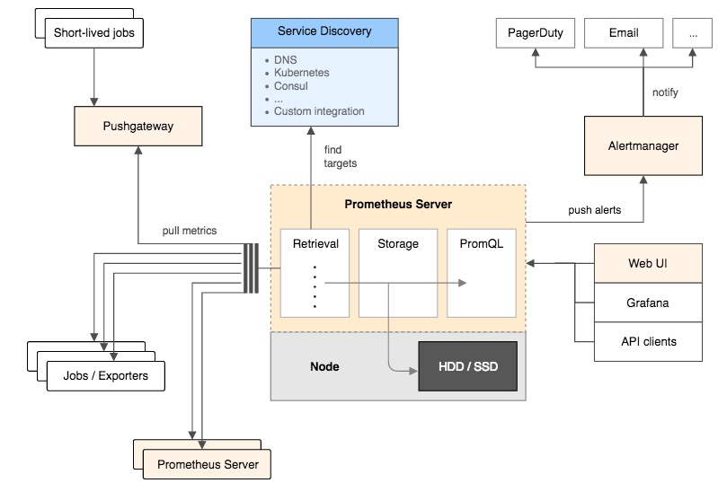
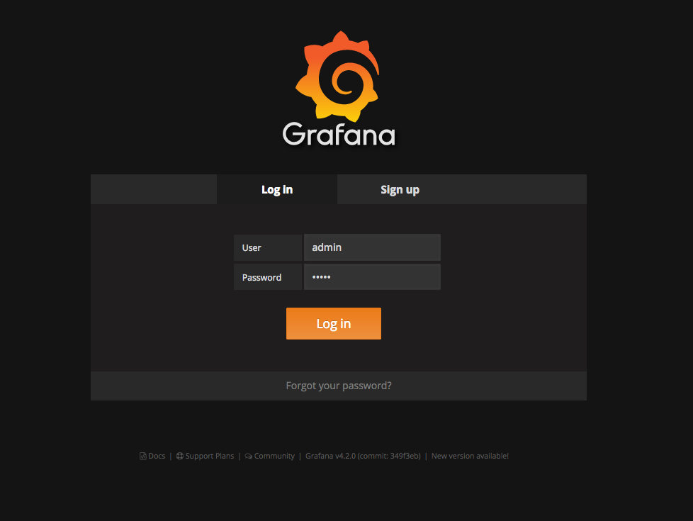
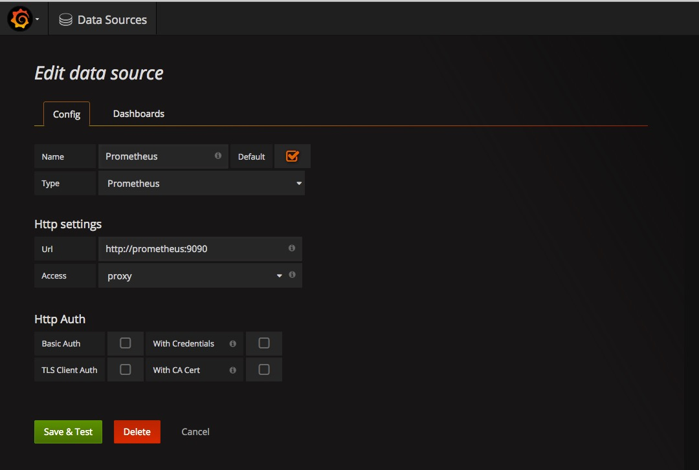
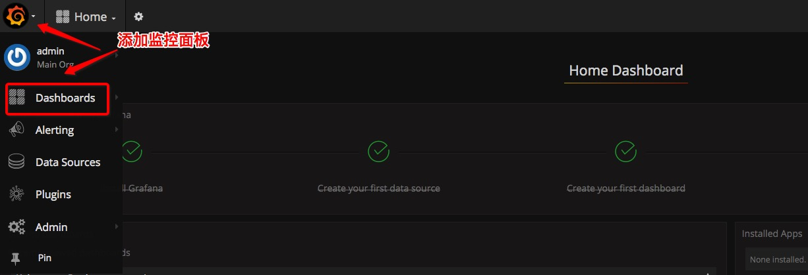
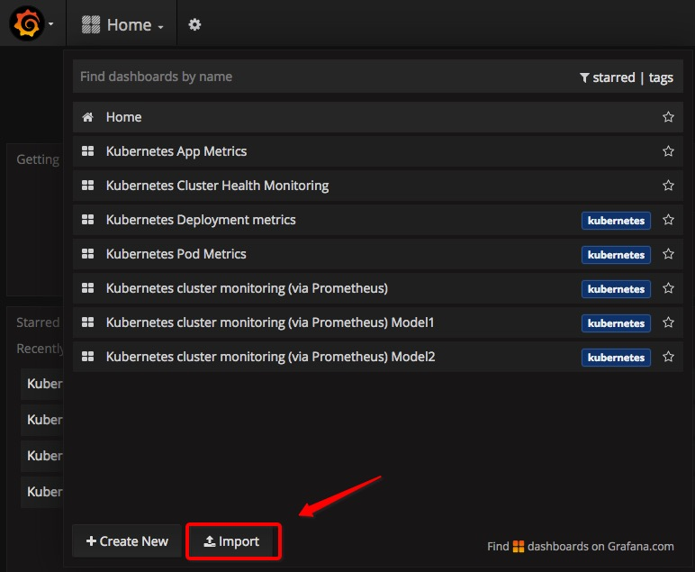
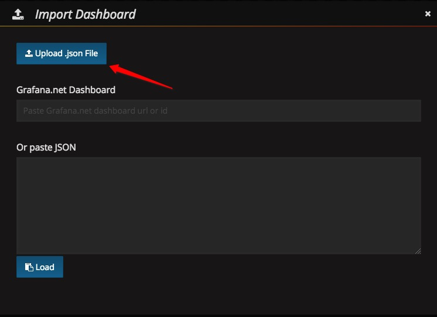
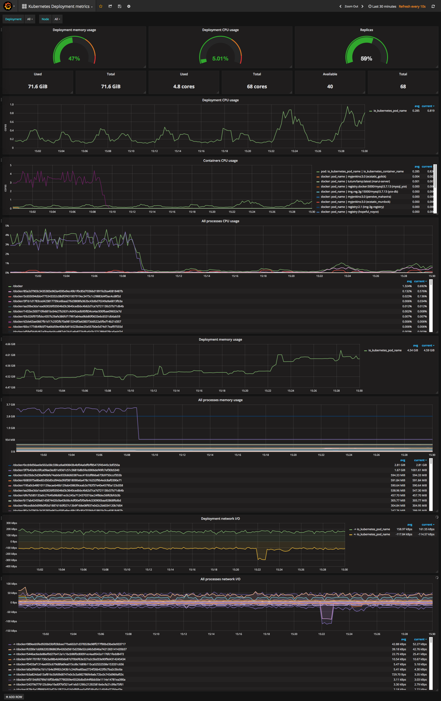
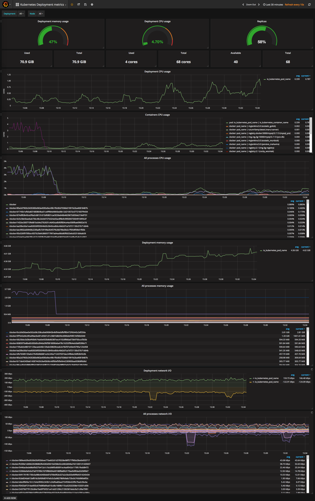
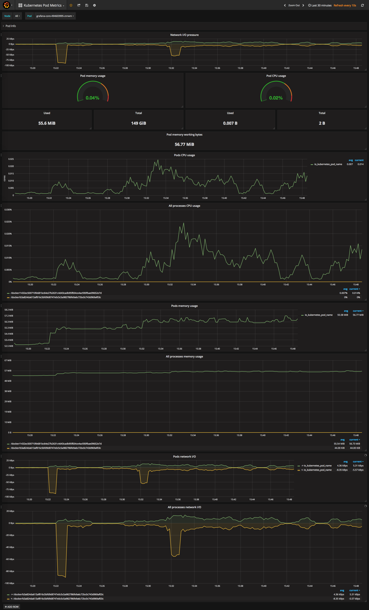
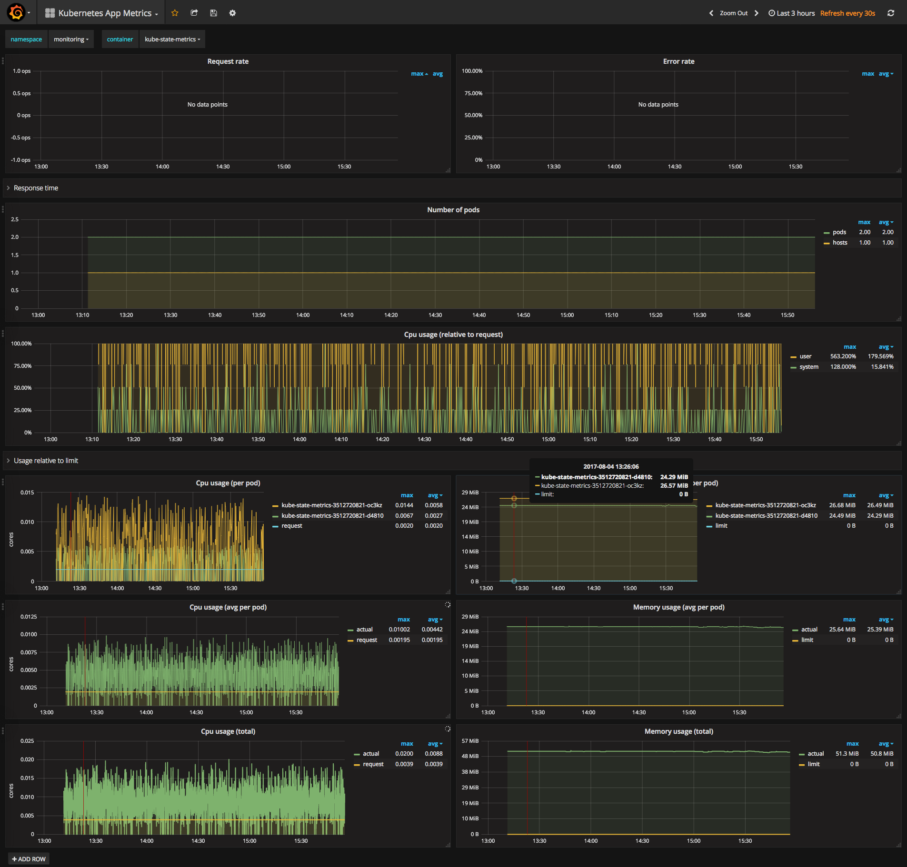

实战 | 使用Prometheus监控Kubernetes集群和应用
====================================

### 一、环境准备
----------------

必要的环境：

* Kubernetes集群，版本1.4以上

* 相关镜像准备:

	* gcr.io/google_containers/kube-state-metrics:v0.5.0

	* prom/prometheus:v1.7.0

	* prom/node-exporter:v0.14.0

	* giantswarm/tiny-tools

	* dockermuenster/caddy:0.9.3

	* grafana/grafana:4.2.0

	* quay.io/prometheus/alertmanager:v0.7.1

	可以在这里[下载](prom.tar)所有镜像。

* 将上述镜像下载到本地后，使用`docker load`命令加载到*Kubernetes*每台Node节点上。


### 二、Prometheus介绍
---------------------

*Prometheus*由SoundCloud开源的监控系统，它与*Kubernetes*是**CNCF**组织最初的两个项目，

*Prometheus*很大程度上受到了*Google*的*Borgmon*系统启发，与传统的监控方式不同，*Prometheus*使用**拉(Pull)**的方式。

*Prometheus*是一个监控系统，它不仅仅包含了时间序列数据库，还有全套的抓取、检索、绘图、报警的功能。

下图是*Prometheus*的架构图：



更多细节请访问[*Prometheus*官方网站](https://prometheus.io/docs/introduction/overview/)

### 三、监控组件安装
----------------------

下载*Prometheus*的部署文件:[manifests-all.yaml](manifests-all.yaml)，使用`kubectl`命令创建*Prometheus*各个组件：

```bash
kubectl create -f manifests-all.yaml
```

执行完成后，*Kubernetes*集群中会出现一个新的*Namespace*: "monitoring"，里面有很多组件：

```bash
kubectl get pods,svc,deployment,job,daemonset,ingress --namespace=monitoring

NAME                                     READY     STATUS    RESTARTS   AGE
po/alertmanager-3874563995-fqvet         1/1       Running   1          1d
po/grafana-core-741762473-exne3          1/1       Running   1          2d
po/kube-state-metrics-1381605391-hiqti   1/1       Running   1          1d
po/kube-state-metrics-1381605391-j11e6   1/1       Running   1          2d
po/node-directory-size-metrics-0abcp     2/2       Running   2          16d
po/node-directory-size-metrics-6xmzk     2/2       Running   2          16d
po/node-directory-size-metrics-d5cka     2/2       Running   2          16d
po/node-directory-size-metrics-ojo1x     2/2       Running   2          16d
po/node-directory-size-metrics-rdvn8     2/2       Running   2          16d
po/node-directory-size-metrics-tfqox     2/2       Running   2          16d
po/node-directory-size-metrics-wkec1     2/2       Running   2          16d
po/prometheus-core-4080573952-vu2dg      1/1       Running   49         1d
po/prometheus-node-exporter-1dnvp        1/1       Running   1          16d
po/prometheus-node-exporter-64763        1/1       Running   1          16d
po/prometheus-node-exporter-6h6u0        1/1       Running   1          16d
po/prometheus-node-exporter-i29ic        1/1       Running   1          16d
po/prometheus-node-exporter-i6mvh        1/1       Running   1          16d
po/prometheus-node-exporter-lxqou        1/1       Running   1          16d
po/prometheus-node-exporter-n1n8y        1/1       Running   1          16d
NAME                           CLUSTER-IP      EXTERNAL-IP   PORT(S)    AGE
svc/alertmanager               192.168.3.247   <nodes>       9093/TCP   16d
svc/grafana                    192.168.3.89    <nodes>       3000/TCP   16d
svc/kube-state-metrics         192.168.3.78    <none>        8080/TCP   16d
svc/prometheus                 192.168.3.174   <nodes>       9090/TCP   16d
svc/prometheus-node-exporter   None            <none>        9100/TCP   16d
NAME                        DESIRED   CURRENT   UP-TO-DATE   AVAILABLE   AGE
deploy/alertmanager         1         1         1            1           16d
deploy/grafana-core         1         1         1            1           16d
deploy/kube-state-metrics   2         2         2            2           16d
deploy/prometheus-core      1         1         1            1           16d
NAME                             DESIRED   SUCCESSFUL   AGE
jobs/grafana-import-dashboards   1         1            16d
NAME                             DESIRED   CURRENT   NODE-SELECTOR   AGE
ds/node-directory-size-metrics   7         7         <none>          16d
ds/prometheus-node-exporter      7         7         <none>          16d
NAME          HOSTS                ADDRESS   PORTS     AGE
ing/grafana   grafana.yeepay.com             80        16d
```

*manifests-all.yaml*文件中使用30161和30162的*Nodeport*端口作为*Grafana*和*Prometheus* Web界面的访问端口。


### 四、监控初始化
----------------------------------

#### 1、 登录*Grafana*
---------------------

通过[http://${Your_API_SERVER_IP}:30161/]()登录*Grafana*，默认的用户名和密码都是*admin*，登录如下图所示：




#### 2、添加数据源
-------------------

点击左上角图标，找到*DataSource*选项，添加数据源：


#### 3、添加*Prometheus*的数据源
--------------------

将*Prometheus*的作为数据源的相关参数如下图所示：



点击*Save & Test*按钮，保存数据源。


#### 五、监控*Kubernetes*集群
---------------

#### 1、导入模板文件：
--------------------

点击左上角*Grafana*的图标，选在*Dashboard*选项：



点击*Import*导入监控模板：



可以从[这里](https://grafana.com/dashboards)下载各种监控模板，然后使用*Upload*到*Grafana*:




#### 2、Kubernetes集群监控实例
------------



下载此监控模板：[kubernetes-cluster-monitoring-via-prometheus_rev2.json](grafana/kubernetes-cluster-monitoring-via-prometheus_rev2.json)


#### 3、Deployment级别监控实例
------------------



下载此监控模板：[deployment-metrics_rev1.json](grafana/deployment-metrics_rev1.json)

#### 4、Pod级别资源监控实例
-----------------



下载此监控模板：[pod-metrics_rev2.json](grafana/pod-metrics_rev2.json)

#### 5、App级别的资源、请求量监控实例
--------------



下载此监控模板：[kubernetes-apps_rev1.json](grafana/kubernetes-apps_rev1.json)
