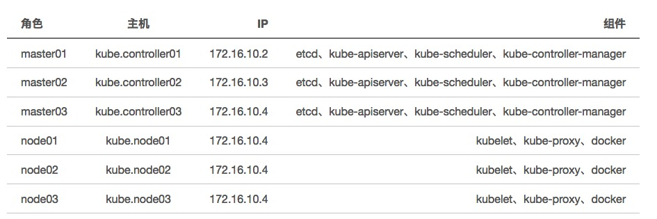

Kubernetes 1.6.0 高可靠集群部署
=====================

原文链接：https://www.addops.cn/post/kubernetes-deployment.html

> 这段时间要基于 kubernetes 来构建我们的容器化平台，所以陆续会有一波关于 kubernetes 及容器化的文章，敬请大家关注。

今天是第一篇，来说一下我们 kubernetes 集群的部署。

### 预热
-----------

当前关于 kubernetes 的部署文章（包括官方文档）基本都是单 master 部署方式，满足不了高可靠的需求。我们基于多 master 节点的方式来实现 kubernetes 控制节点的高可靠。先看一张官方高可用的逻辑部署图:


根据这张图，我们来部署我们的 kubernetes 环境。


### 基础环境
-----------

* 操作系统：CentOS 7.2

* Kubernetes： 1.6.0

* ETCD： 3.1.0

* Docker: 1.13.1




### 基础组件安装
-----------

#### YUM源更新
-----------

这里我们都是基于官方 release 自己打的 rpm 包放到自己的yum仓库中。

#### 安装 ETCD
-----------

因为是自己打的rpm包，所以安装非常简单

**安装**

```bash
yum -y install addops-etcd-3.1.0-1.el7.x86_64
```

**配置**

路径: `/etc/etcd/etcd.conf`

修改: `/usr/lib/systemd/system/etcd.service`中的`EnvironmentFile`如下：`EnvironmentFile=-/etc/etcd/etcd.conf`

> 官方配置默认在 /usr/lib/systemd/system/etcd.service 启动文件中设置， 由于 systemd 本身特性，每次在修改参数后都需要 systemctl daemon-reload 才能执行服务重启，这样很麻烦，所以我们将其配置单独拎出来放到了 /etc/etcd/etcd.conf 中，然后在启动文件中通过 EnvironmentFile=-/etc/etcd/etcd.conf 告诉 etcd 服务从这个配置文件读取变量。后面 kubernetes 组件同理。 

```bash
# [member]
ETCD_NAME=kube.controller01
ETCD_DATA_DIR="/var/lib/etcd/kube.controller01.etcd"
ETCD_LISTEN_PEER_URLS="http://kube.controller01:2380"
ETCD_LISTEN_CLIENT_URLS="https://kube.controller01:2379,http://127.0.0.1:2379"
#
#
#[cluster]
ETCD_INITIAL_ADVERTISE_PEER_URLS="http://kube.controller01:2380"
ETCD_INITIAL_CLUSTER="app02=http://kube.controller01:2380,app03=http://kube.controller02:2380,app04=http://kube.controller03:2380"
ETCD_INITIAL_CLUSTER_STATE="new"
ETCD_INITIAL_CLUSTER_TOKEN="YmpkdC10ZXN0"
ETCD_ADVERTISE_CLIENT_URLS="https://kube.controller01:2379"
#
#
#[proxy]
#ETCD_PROXY="off"
#
#[security]
ETCD_CERT_FILE="/etc/etcd/ssl/kube.controller01.crt"
ETCD_KEY_FILE="/etc/etcd/ssl/kube.controller01.key"
ETCD_CLIENT_CERT_AUTH="true"
ETCD_TRUSTED_CA_FILE="/etc/etcd/ssl/ca.crt"
#
#[logging]
ETCD_DEBUG="true"
ETCD_LOG_PACKAGE_LEVELS="etcdserver=WARNING,security=DEBUG"
```

以上配置项是我们经过裁剪后的，有一些参数有默认值我们没有修改，也就没有加到这里。其它支持的参数查看（etcd -h），可以根据自己的实际情况进行修改。

**启动服务**

3 个节点注册并启动服务

```bash
systemctl enable etcd.service
systemctl start etcd.service
```

**验证**

部署完成后，我们需要检验一下部署的是否成功，这里我们可以使用 etcdctl 这个命令行工具来对 etcd 进行验证：

```bash
etcdctl --ca-file=/root/.ssl/ca.crt --cert-file=/root/.ssl/etcd-client.crt --key-file=/root/.ssl/etcd-client.key cluster-health
member 497350af3952bc25  is healthy: got healthy result from https://kube.controller01:2379
member 50403524dd0d2c3d is healthy: got healthy result from https://kube.controller02:2379
member 8e8b64149fae0cdd  is healthy: got healthy result from https://kube.controller03:2379
cluster is healthy
```

我们看到 “cluster is healthy”，集群状态正常。

> 这里我们对 client 对 etcd 的访问打开了 tls 认证，client 访问时需要使用 https 访问，增加安全性（关于 tls 的配置，我会单独一篇来介绍）。

#### 安装 kubernetes master 节点
-----------

**安装**

```bash
yum install -y addops-kubernetes-master-1.6.0-1.el7
yum install -y addops-kubernetes-1.6.0-1.el7
yum install -y addops-kubernetes-client-1.6.0-1.el7
```

**配置**

配置文件路径 /etc/kubernetes/master-config

这个配置文件也是我们自己添加的，原因同上，这里不再细说。
不过要注意的是这里要修改3个启动文件:

```bash
/usr/lib/systemd/system/kube-apiserver.service
/usr/lib/systemd/system/kube-scheduler.service
/usr/lib/systemd/system/kube-controller-manager.service
```

```bash
###
# kubernetes common config
KUBE_COMMON_ARGS="--logtostderr=false \
                  --v=3"

###
# kubernetes apiserver config
KUBE_API_ARGS="--etcd-servers=https://kube.controller01:2379,https://kube.controller02:2379,https://kube.controller03:2379 \
               --etcd-cafile=/etc/kubernetes/ssl/ca.crt \
               --etcd-certfile='/etc/kubernetes/ssl/etcd-client.crt' \
               --etcd-keyfile='/etc/kubernetes/ssl/etcd-client.key' \
               --authorization-mode=ABAC \
               --authorization-policy-file=/etc/kubernetes/policy.jsonl \
               --client-ca-file=/etc/kubernetes/ssl/ca.crt \
               --tls-cert-file='/etc/kubernetes/ssl/*.kube.apiserver.crt' \
               --tls-private-key-file='/etc/kubernetes/ssl/*.kube.apiserver.key' \
               --service-cluster-ip-range=192.168.0.0/16 \
               --allow-privileged=true"


###
# kubernetes scheduler config
KUBE_SCHEDULER_ARGS="--master=http://127.0.0.1:8080 \
                     --leader-elect=true \
                     --leader-elect-lease-duration=150s \
                     --leader-elect-renew-deadline=100s \
                     --leader-elect-retry-period=20s"
###
# kubernetes scheduler config
KUBE_CONTROLLER_MANAGER_ARGS="--master=http://127.0.0.1:8080 \
                              --leader-elect=true \
                              --leader-elect-lease-duration=150s \
                              --leader-elect-renew-deadline=100s \
                              --leader-elect-retry-period=20s"

```

**启动服务**

3 个节点注册并启动服务

```bash
systemctl enable kube-apiserver.service
systemctl enable kube-scheduler.service
systemctl enable kube-controller-manager.service

systemctl start kube-apiserver.service
systemctl start kube-scheduler.service
systemctl start kube-controller-manager.service
```

**验证**

可以通过`kubectl` 命令工具来查看当前集群各个组件的运行状态:

```bash
kubectl get componentstatuses

NAME                 STATUS      MESSAGE                                                                                ERROR
scheduler            Healthy     ok                                                                                     
controller-manager   Healthy     ok                                                                                     
etcd-0               Unhealthy   Get https://kube.controller01:2379/health: remote error: tls: bad certificate   
etcd-2               Unhealthy   Get https://kube.controller02:2379/health: remote error: tls: bad certificate   
etcd-1               Unhealthy   Get https://kube.controller03:2379/health: remote error: tls: bad certificate
```

从这里我们可以很明显看到 etcd 集群处于 Unhealthy 状态。

*apiserver*是无状态的，所以对于多个节点而言可以通过前端挡一层*nginx* 、*haproxy* 等实现高可用和负载均衡，而对于*scheduler* 和*controller-managere*而言，它们需要操作后端存储*etcd*，是有状态的，为了减少同步操作后端存储带来的数据不一致性，3 个 节点的*scheduler*和*controller-manager*组件同时只有一个提供服务，具体的实现就是3个节点之间会进行一个*leader*的选举，只有*leader*节点才提供服务。因此，验证选举工作是否正常也是非常重要的。

查看当前3个*scheduler*和*controller-manager*哪个是*leader*节点：

```bash
kubectl get endpoints kube-controller-manager --namespace=kube-system -o yaml
```

知道当前哪个节点是 leader 后可以将其服务关闭，然后再查看 leader 节点是否发生变化，集群工作是否工作正常就OK了。

#### 安装Kubernetes Node节点
-----------

**Docker安装**

底层*driver*我们使用的是*devicemapper*，后端存储的划分详见[这里](https://docs.docker.com/engine/userguide/storagedriver/device-mapper-driver/)

划分好*docker*的后端存储后，就可以安装*docker engine*了。

```bash
yum install -y docker-engine-selinux-1.12.1-1.el7.centos
yum install -y docker-engine-1.12.1-1.el7.centos
```

**配置**

配置我们也是把它单独拎出来，放到了/etc/docker/daemon.json中:

```json
{
        "authorization-plugins": [],
        "dns": [],
        "dns-opts": [],
        "dns-search": [],
        "exec-opts": ["native.cgroupdriver=cgroupfs"],
        "exec-root": "",
        "storage-driver": "devicemapper",
        "storage-opts": [
            "dm.thinpooldev=/dev/mapper/VolGroup00-thinpool",
            "dm.use_deferred_removal=true",
            "dm.use_deferred_deletion=true",
            "dm.blkdiscard=false",
            "dm.override_udev_sync_check=true"
        ],
        "labels": ["com.example.environment=\"production\""],
        "bip": "172.16.65.1/24",
        "ip-masq": true,
        "mtu": 1450,
        "iptables": true,
        "pidfile": "",
        "graph": "/data/docker",
        "cluster-store": "",
        "cluster-store-opts": {},
        "cluster-advertise": "",
        "max-concurrent-downloads": 3,
        "max-concurrent-uploads": 5,
        "debug": true,
        "hosts": ["tcp://0.0.0.0:2375", "unix:///var/run/docker.sock"],
        "log-level": "",
        "api-cors-header": "",
        "selinux-enabled": false,
        "userns-remap": "",
        "group": "",
        "cgroup-parent": "",
        "raw-logs": false,
        "registry-mirrors": ["http://4093ad04.m.daocloud.io"],
        "disable-legacy-registry": true,
        "live-restore": true,
        "default-runtime": "runc"
}
```

配置中有几项需要配合flannel使用：

```bash
        "bip": "172.16.65.1/24",
        "ip-masq": true,
        "mtu": 1450,
        "iptables": true,
```

这个我们会在 flannel 的部署章节介绍。

**Kubelet安装**

```bash
yum install -y addops-kubernetes-1.6.0-1.el7
yum install -y addops-kubernetes-node-1.6.0-1.el7
```

配置

```bash
###
# kubernetes common config
KUBE_COMMON_ARGS="--logtostderr=false \
                  --v=2"

###
# kubernetes kubelet config
KUBELET_ARGS="--hostname-override=kube.node01 \
              --api-servers=https://kube.apiserver:6443 \
              --register-node=true \
              --kubeconfig=/etc/kubernetes/kubeconfig \
              --kube-reserved=cpu=500m,memory=512Mi \
              --pod-infra-container-image='r.addops.cn/public/pause-amd64:3.0'"

###
# kubernetes proxy config
KUBE_PROXY_ARGS="--hostname-override=kube.node01 \
                 --master=https://kube-apiserver:6443 \
                 --kubeconfig=/etc/kubernetes/kubeconfig \
                 --proxy-mode=iptables"
```

**验证**

在控制节点查看 node 的状态是否正常:

```bash
kubectl get nodes

NAME             STATUS    AGE       VERSION
kube.node01      Ready     5d        v1.6.0
kube.node02      Ready     5d        v1.6.0
kube.node03      Ready     5d        v1.6.0
```

到此 kubernetes 的部署基本就结束了，剩下的就是功能性的验证了。

对于 TLS 和 Flannel 我们会单独写两篇文章单独介绍，感兴趣的可以注意查看，我们后续会发出。
