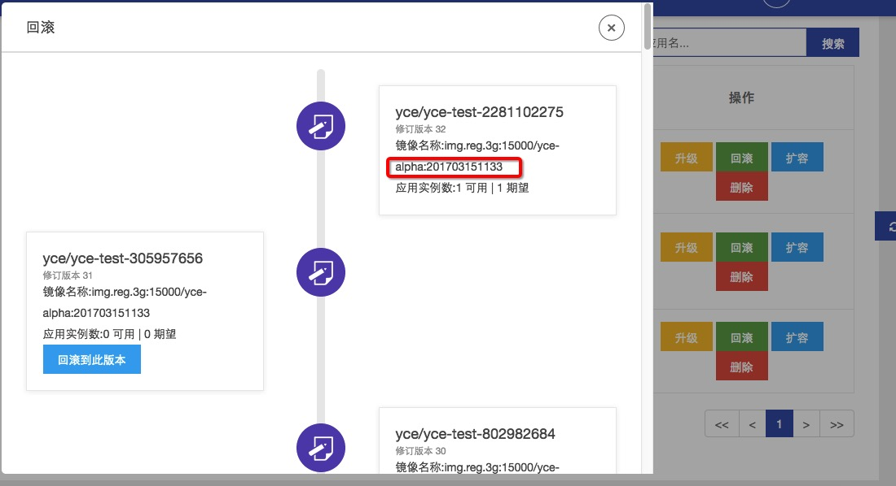
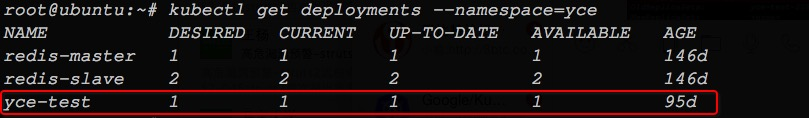
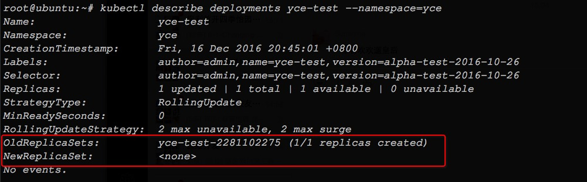
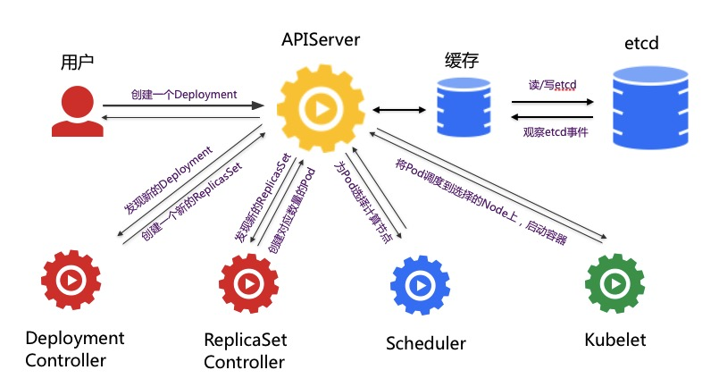
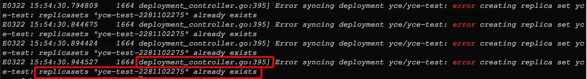
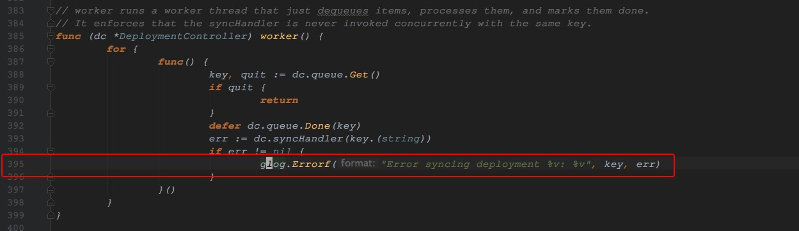
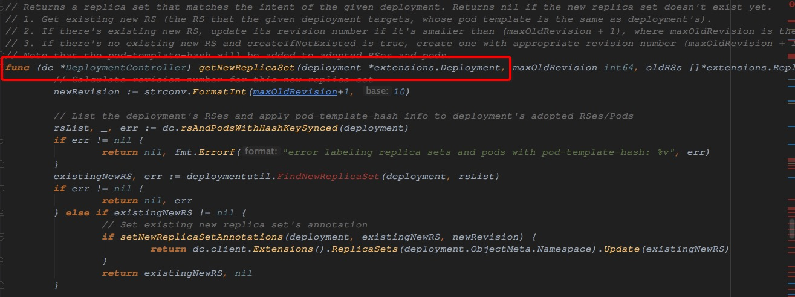
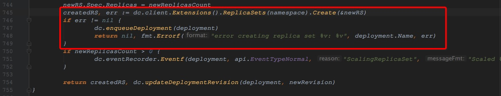
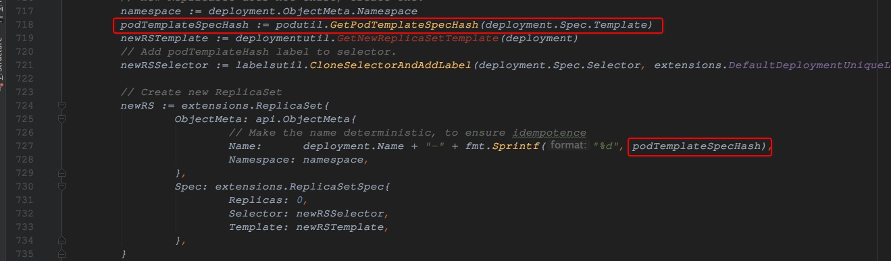
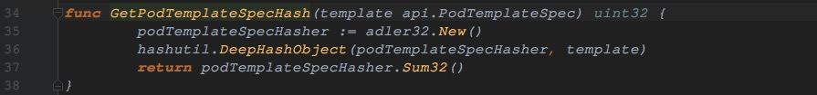

从Kubernetes一个事故说开去
==============================

### 事故还原及定位
------------------

#### 事故回放
------------------

我们使用*Deployment*来管理应用的生命周期，但是最近在测试环境、生产环境偶尔都会发生的一个现象，就是应用滚动升级失败。我们使用*Kubernetes* *Restful API*来调用Kubernetes的滚动升级接口，在请求结束后的几分钟应用仍然没有升级的迹象，从*RevisionHistory*上看，版本一直停留在上一个版本:



如果读者也遇到了这个问题，我们建议您使用一种比较“简单粗暴"的办法:

> **为了保证业务的正常进行，最快、最稳妥的办法就是将该*Deployment*删除，重新发布最新版本的应用。**

很显然，这个解决办法治标不治本。更令人焦虑的是，这种现象在QA环境中发生的频次有越来越高的趋势，引起了我们高度重视，我们想彻底解决这个问题。

#### 追踪现场
------------------

为了不影响业务正常运转，我们将应用使用一个新*Deployment*重新发布，从而为我们保留了事故的现场。在定位问题之前，我们应该看下”现场“中有哪些蛛丝马迹：

先看下Deployment：

```bash
 kubectl get deployments --namespace=yce
```



名称为*yce*的即是我们所要找的应用，我们继续查看该应用：

```bash
kubectl describe deployments yce-test --namespace=yce
```



这里发现了一个异常，*yce*对应的*NewReplicaSet*没有创建，由于没有最新的ReplicaSet，自然就没有对应的Pod，所以说应用不能升级，这里可能是直接原因。接下来我们查找*Kubernetes*的*Events*，没有发现任何跟它相关的异常，通过*Event*进一步定位问题的办法行不通了。

现在我们需要仔细回顾*Deployment*创建*ReplicaSet*再到创建*Pod*的整个过程了：



由于是新的*ReplicaSet*没有创建成功，有可能是在*Deployment Controller*环节出了问题。

顺着这个思路，我们去*kube-controller-manager*组件的日志中去查看是否有相关的线索：

```bash
grep error kube-controller-manager.log | tail -n 10
```



日志中发现了一个与*yce*应用相关的信息，而且错误是由于**replicasets "yce-test-2281102275" already exists**引起。日志也标识出代码的具体位置，接下来我们去代码中查看。

#### 定位代码
------------------

由于我们使用的*Kubernetes*是1.2.0版本，所以我们要在[*Kubernetes 1.2.0*的源代码](https://codeload.github.com/kubernetes/kubernetes/tar.gz/v1.2.0)中寻找，按照日志中的定位，代码在*kubernetes-1.2.0/pkg/controller/deployment/deployment_controller.go*中，定位到395行：



错误日志是从这里打印出来的，但是err又是在哪产生的呢？

我们在deployment_controller.go中寻找，发现一个函数*getNewReplicaSet*：



找到了问题的大概位置，但是还没有确切的定位，有个“already exists"的提示我们还没有使用，我们接着看代码：



*dc.client.Extensions().ReplicaSets(namespace).Create(&newRS)*这部分出现了问题，是因为新的*ReplicaSet*已经存在了，但从上面的现场看，新的并没有创建成功，难道是新的*ReplicaSet*与旧的*ReplicasSet*重名了吗？

接着我们找到*ReplicaSet*名称是如何产生的：



原来，为了保证幂等性，*ReplicaSet*的名称是由*Deployment.Name-PodTemplateHash*两部分组成，难道是*GetPodTemplateSpecHash*函数出现了Hash碰撞？？

我们在定位*GetPodTemplateSpecHash*的代码：



*Kubernete*使用*Deployment*下面的*Spce.Template*的内容和[*adler*](https://en.wikipedia.org/wiki/Adler-32)算法所生成的Hash值作为*ReplicaSet*的名字。我们怀疑这里除了问题，但真相只有一个，我们继续往下追踪。


#### 碰撞试验
------------------

我们将现场作为测试的场景，即我们模拟两个*Deployment.Spec.Template*，看他们的Hash值是否一致，测试代码如下：

```golang
package main

import (
        "encoding/json"
        // "k8s.io/kubernetes/pkg/api"
        "fmt"
        "k8s.io/kubernetes/pkg/apis/extensions"
        podutil "k8s.io/kubernetes/pkg/util/pod"
)

const (
        DeploymentNewStr = `{
    "kind": "Deployment",
    "apiVersion": "extensions/v1beta1",
    "metadata": {
        "name": "yce-test",
        "namespace": "yce",
        "selfLink": "/apis/extensions/v1beta1/namespaces/yce/deployments/yce-test",
        "uid": "757f39f0-c38d-11e6-977e-44a84240716a",
        "resourceVersion": "78916094",
        "generation": 81,
        "creationTimestamp": "2016-12-16T12:45:01Z",
        "labels": {
            "author": "admin",
            "name": "yce-test",
            "version": "alpha-test-2016-10-26"
        },
        "annotations": {
            "deployment.kubernetes.io/revision": "32",
            "image": "img.reg.3g:15000/yce-alpha:201703211640",
            "kubernetes.io/change-cause": "update to 201703211640",
            "userId": "1"
        }
    },
    "spec": {
        "replicas": 1,
        "selector": {
            "matchLabels": {
                "author": "admin",
                "name": "yce-test",
                "version": "alpha-test-2016-10-26"
            }
        },
        "template": {
            "metadata": {
                "creationTimestamp": null,
                "labels": {
                    "author": "admin",
                    "name": "yce-test",
                    "version": "alpha-test-2016-10-26"
                }
            },
            "spec": {
                "containers": [
                    {
                        "name": "yce-test",
                        "image": "img.reg.3g:15000/yce-alpha:201703211640",
                        "ports": [
                            {
                                "containerPort": 8080,
                                "protocol": "TCP"
                            }
                        ],
                        "env": [
                            {
                                "name": "DB_HOST",
                                "value": "mysql-test.yce:3306"
                            },
                            {
                                "name": "DB_USER",
                                "value": "root"
                            },
                            {
                                "name": "DB_PASS",
                                "value": "root"
                            },
                            {
                                "name": "DB_NAME",
                                "value": "yce"
                            },
                            {
                                "name": "REDIS_HOST",
                                "value": "redis-master.yce:6379"
                            },
                            {
                                "name": "QA",
                                "value": "QA"
                            },
                            {
                                "name": "SIAGENTHOST",
                                "value": "172.21.1.11"
                            },
                            {
                                "name": "SIAGENTPORT",
                                "value": "31080"
                            }
                        ],
                        "resources": {
                            "limits": {
                                "cpu": "2",
                                "memory": "4Gi"
                            }
                        },
                        "terminationMessagePath": "/dev/termination-log",
                        "imagePullPolicy": "IfNotPresent"
                    }
                ],
                "restartPolicy": "Always",
                "terminationGracePeriodSeconds": 30,
                "dnsPolicy": "ClusterFirst",
                "securityContext": {}
            }
        },
        "strategy": {
            "type": "RollingUpdate",
            "rollingUpdate": {
                "maxUnavailable": 2,
                "maxSurge": 2
            }
        }
    },
    "status": {
        "observedGeneration": 80,
        "replicas": 1,
        "updatedReplicas": 1,
        "availableReplicas": 1
    }
}`

        DeploymentOldStr = `{
  "status": {
    "availableReplicas": 1,
    "updatedReplicas": 1,
    "replicas": 1,
    "observedGeneration": 80
  },
  "spec": {
    "strategy": {
      "rollingUpdate": {
        "maxSurge": 2,
        "maxUnavailable": 2
      },
      "type": "RollingUpdate"
    },
    "template": {
      "spec": {
        "securityContext": {},
        "dnsPolicy": "ClusterFirst",
        "terminationGracePeriodSeconds": 30,
        "restartPolicy": "Always",
        "containers": [
          {
            "imagePullPolicy": "IfNotPresent",
            "terminationMessagePath": "/dev/termination-log",
            "resources": {
              "limits": {
                "memory": "4Gi",
                "cpu": "2"
              }
            },
            "env": [
              {
                "value": "mysql-test.yce:3306",
                "name": "DB_HOST"
              },
              {
                "value": "root",
                "name": "DB_USER"
              },
              {
                "value": "root",
                "name": "DB_PASS"
              },
              {
                "value": "yce",
                "name": "DB_NAME"
              },
              {
                "value": "redis-master.yce:6379",
                "name": "REDIS_HOST"
              },
              {
                "value": "QA",
                "name": "QA"
              },
              {
                "value": "172.21.1.11",
                "name": "SIAGENTHOST"
              },
              {
                "value": "31080",
                "name": "SIAGENTPORT"
              }
            ],
            "ports": [
              {
                "protocol": "TCP",
                "containerPort": 8080
              }
            ],
            "image": "img.reg.3g:15000/yce-alpha:201703151133",
            "name": "yce-test"
          }
        ]
      },
      "metadata": {
        "labels": {
          "version": "alpha-test-2016-10-26",
          "name": "yce-test",
          "author": "admin"
        },
        "creationTimestamp": null
      }
    },
    "selector": {
      "matchLabels": {
        "version": "alpha-test-2016-10-26",
        "name": "yce-test",
        "author": "admin"
      }
    },
    "replicas": 1
  },
  "metadata": {
    "annotations": {
      "userId": "1",
      "kubernetes.io/change-cause": "update to 201703211640",
      "image": "img.reg.3g:15000/yce-alpha:201703211640",
      "deployment.kubernetes.io/revision": "32"
    },
    "labels": {
      "version": "alpha-test-2016-10-26",
      "name": "yce-test",
      "author": "admin"
    },
    "creationTimestamp": "2016-12-16T12:45:01Z",
    "generation": 81,
    "uid": "757f39f0-c38d-11e6-977e-44a84240716a",
    "selfLink": "/apis/extensions/v1beta1/namespaces/yce/deployments/yce-test",
    "namespace": "yce",
    "name": "yce-test"
  },
  "apiVersion": "extensions/v1beta1",
  "kind": "Deployment"
}`
)

func main() {

        newDp:= new(extensions.Deployment)
        json.Unmarshal([]byte(DeploymentNewStr), &newDp)

        oldDp:= new(extensions.Deployment)
        json.Unmarshal([]byte(DeploymentOldStr), &oldDp)

        podTemplateSpecHash := podutil.GetPodTemplateSpecHash(newDp.Spec.Template)
        podTemplateSpecHashOld := podutil.GetPodTemplateSpecHash(oldDp.Spec.Template)

        fmt.Printf("%d, %s\n", podTemplateSpecHash, newDp.Spec.Template.Spec.Containers[0].Image)
        fmt.Printf("%d, %s\n", podTemplateSpecHashOld, oldDp.Spec.Template.Spec.Containers[0].Image)
}
```

我们使用现有的*Deployment*导出Json，然后将他们反序列号成*Kubernetes Deployment*对象，两个对象之间只有*Spec.Template.Contaienrs[0]*不同，也就是说只是镜像名称不同，旧的是*img.reg.3g:15000/yce-alpha:201703151133*，要升级的镜像是*img.reg.3g:15000/yce-alpha:201703151133*。执行结果如下：

```bash
go run hasher.go
985343960, img.reg.3g:15000/yce-alpha:201703211640
985343960, img.reg.3g:15000/yce-alpha:201703151133
```

*简直难以置信！真的发生了Hash碰撞！！*

从最近越来越频繁的滚动升级失败来看，我们认为这个问题非常严重，所以我们决定给社区提交Issue。


由于篇幅的关系，我们将在以后的文章中，继续介绍社区对这个问题的讨论以及解决办法，敬请期待。

### 解决方案讨论
------------------
