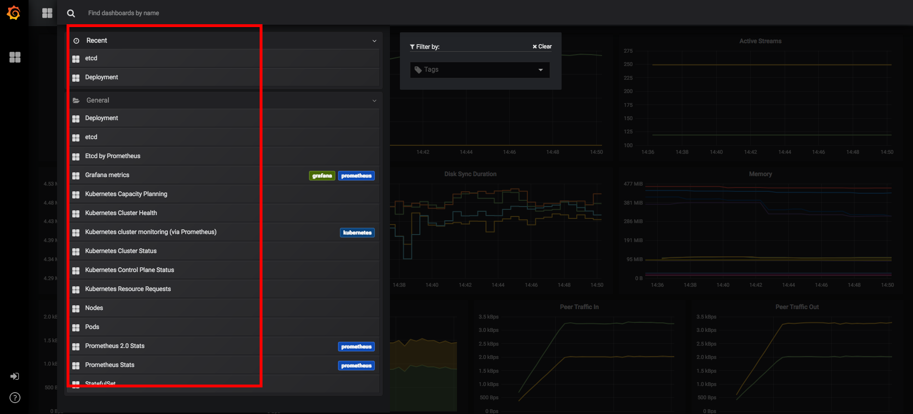

使用prometheus-operator搭建kubernetes集群
=========================================


### 环境准备
----

* 准备好Kubernetes 1.9.3 (>=1.8)

* 下载[Prometheus-Opterator](https://github.com/coreos/prometheus-operator)

* 镜像准备：

	* gcr.io/google_containers/addon-resizer:1.0

	* quay.io/brancz/kube-rbac-proxy:v0.2.0

	* quay.io/coreos/configmap-reload:v0.0.1

	* quay.io/coreos/kube-state-metrics:v1.2.0

	* quay.io/coreos/monitoring-grafana:5.0.0

	* quay.io/coreos/prometheus-config-reloader:v0.0.2

	* quay.io/coreos/prometheus-operator:v0.17.0

	* quay.io/prometheus/alertmanager:v0.14.0

	* quay.io/prometheus/node-exporter:v0.15.2

* 确保这些镜像都已经部署在了每台Node节点上

### 开始部署Prometheus
----

创建*Prometheus*监控*Kubernetes*所需的ServiceAccout/RoleBinding等：

```bash
kubectl apply -f bundle.yaml
```

使用如下命令可以一键部署*Prometheus*所有服务:

```bash
cd contrib/kube-prometheus/
hack/cluster-monitoring/deploy
```

稍等几分钟，*Prometheus*相关的服务都会创建好：

```bash
kubectl get deployment,svc,pods,sa,secrets,cm,servicemonitor,crd -n monitoring
NAME                         DESIRED   CURRENT   UP-TO-DATE   AVAILABLE   AGE
deploy/grafana               1         1         1            1           3d
deploy/kube-state-metrics    1         1         1            1           3d
deploy/prometheus-operator   1         1         1            1           3d
deploy/while                 1         1         1            1           3d

NAME                        TYPE        CLUSTER-IP      EXTERNAL-IP   PORT(S)             AGE
svc/alertmanager-main       NodePort    170.10.26.82    <none>        9093:30903/TCP      3d
svc/alertmanager-operated   ClusterIP   None            <none>        9093/TCP,6783/TCP   3d
svc/etcd-k8s                ClusterIP   None            <none>        2379/TCP            1d
svc/grafana                 NodePort    170.10.87.189   <none>        3000:30902/TCP      3d
svc/kube-state-metrics      ClusterIP   None            <none>        8443/TCP,9443/TCP   3d
svc/node-exporter           ClusterIP   None            <none>        9100/TCP            3d
svc/prometheus-k8s          NodePort    170.10.6.196    <none>        9090:30900/TCP      3d
svc/prometheus-operated     ClusterIP   None            <none>        9090/TCP            3d
svc/prometheus-operator     ClusterIP   170.10.113.11   <none>        8080/TCP            3d

NAME                                      READY     STATUS    RESTARTS   AGE
po/alertmanager-main-0                    2/2       Running   0          2d
po/alertmanager-main-1                    2/2       Running   0          2d
po/alertmanager-main-2                    2/2       Running   0          2d
po/grafana-595667966c-tvvvd               1/1       Running   0          3d
po/kube-state-metrics-6756b4754d-b25rz    4/4       Running   0          3d
po/node-exporter-5mjs7                    2/2       Running   0          3d
po/node-exporter-85xlc                    2/2       Running   0          3d
po/node-exporter-f4v7x                    2/2       Running   0          3d
po/prometheus-k8s-0                       2/2       Running   0          1d
po/prometheus-k8s-1                       2/2       Running   0          1d
po/prometheus-operator-5c8774cdd8-66nvp   1/1       Running   0          3d
po/while-7fb7c5cfb9-fcczk                 1/1       Running   0          3d

NAME                     SECRETS   AGE
sa/default               1         3d
sa/kube-state-metrics    1         3d
sa/node-exporter         1         3d
sa/prometheus-k8s        1         3d
sa/prometheus-operator   1         3d

NAME                                      TYPE                                  DATA      AGE
secrets/alertmanager-main                 Opaque                                1         3d
secrets/default-token-bsvw8               kubernetes.io/service-account-token   3         3d
secrets/etcd-certs                        Opaque                                3         1d
secrets/grafana-credentials               Opaque                                2         3d
secrets/kube-state-metrics-token-h2mpc    kubernetes.io/service-account-token   3         3d
secrets/node-exporter-token-k2stt         kubernetes.io/service-account-token   3         3d
secrets/prometheus-k8s                    Opaque                                2         3d
secrets/prometheus-k8s-token-dm2hw        kubernetes.io/service-account-token   3         3d
secrets/prometheus-operator-token-ms6dn   kubernetes.io/service-account-token   3         3d

NAME                                 DATA      AGE
cm/grafana-dashboard-definitions-0   10        3d
cm/grafana-dashboards                1         3d
cm/grafana-datasources               1         3d
cm/prometheus-k8s-rules              10        3d

NAME                                      AGE
servicemonitors/alertmanager              3d
servicemonitors/etcd-k8s                  1d
servicemonitors/kube-apiserver            3d
servicemonitors/kube-controller-manager   3d
servicemonitors/kube-scheduler            3d
servicemonitors/kube-state-metrics        3d
servicemonitors/kubelet                   3d
servicemonitors/node-exporter             3d
servicemonitors/prometheus                3d
servicemonitors/prometheus-operator       3d

NAME                                                              AGE
customresourcedefinitions/alertmanagers.monitoring.coreos.com     3d
customresourcedefinitions/prometheuses.monitoring.coreos.com      3d
customresourcedefinitions/servicemonitors.monitoring.coreos.com   3d
```

### 使用Prometheus
------

#### Prometheus Web界面
-----

默认配置下，Prometheus web使用30900的NodePort作为访问端口，打开`http://nodeip:30900/`查看web界面：


Prometheus的监控面板使用NodePort 30902做作为访问入口，使用`amdin/admin`进行登录。

*Prometheus*的*Dashboard*提供了各种监控模板，涵盖`Cluster/Node/Deployment/StatefulSet/Pods`等多个维度，基本上够用了：



下面展示几个示例：

**Kubernetes Cluster Health*


**Kubernetes Nodes**


**Kubernetes Pods**


**Kubernetes Deployement**


**Kubernetes StatefulSet**


*ETCD*集群是`Kubernetes`的大脑，上述部署方式不支持*ETCD*集群的监控，需要额外部署
