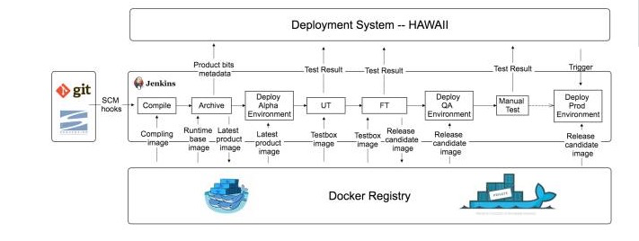

持续交付
==========================

**if it hurts, do it more often, and bring the pain forward.**

#### 部署流水线
---------------------

#### 持续交付的优点：
---------------------

#### 持续发布的原则：
---------------------

1. 发布应该是一个可重复、可靠的过程

2. 发布过程尽可能的自动化

3. 发布过程尽可能多的使用版本控制

4. 频繁地发布，持续改进、优化发布流程

5. 保证构建阶段产出（可执行文件）的质量

6. 跟交付相关的所有人都对交付过程负有责任

7. 

#### 实践：
-----------------------

1. 只构建可执行文件一次，它在多个环境（测试、生产）中运行

2. 在不同环境中部署使用相同的方式

3. 每次部署完成后都进行冒烟测试

4. 先在准生产环境发布，再发布到生产环境

5. 任何修改都要重新执行部署流水线

6. 在发布过程中，任何环节出现服务，立即终止流水线执行，并将错误信息反馈给用户
